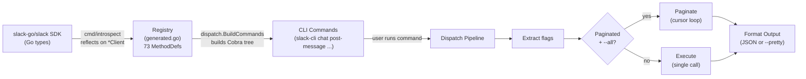

# slack-cli

A command-line interface for the [Slack Web API](https://api.slack.com/methods), built in Go. It wraps 73 Slack API methods as CLI commands, so you can interact with Slack from scripts, automation pipelines, or your terminal.

**JSON-first** for machines and agents. **`--pretty`** for humans.

```bash
# List your Slack channels
slack-cli conversations list --limit 5

# Post a message
slack-cli chat post-message --channel C01ABCDEF --text "Hello from slack-cli"

# Fetch all members of a channel (follows pagination automatically)
slack-cli conversations members --channel C01ABCDEF --all
```

## Table of Contents

- [Why This Exists](#why-this-exists)
- [How It Works](#how-it-works)
- [Getting Started](#getting-started)
- [Usage](#usage)
- [Architecture](#architecture)
- [Development](#development)

## Why This Exists

Slack has a large Web API, but interacting with it typically means writing one-off scripts, managing pagination by hand, and parsing raw HTTP responses. This tool gives you a typed, discoverable CLI over that API surface. Every command maps directly to a Slack API method, so the [Slack API docs](https://api.slack.com/methods) serve as your reference.

It is designed to be consumed by both humans and AI agents (MCP tools, automation scripts) through structured JSON output and deterministic exit codes.

## How It Works

The core idea: instead of hand-writing 73 CLI commands, we **generate** them by introspecting the Go SDK that Slack already maintains.



Here is what happens step by step:

1. **Code generation** (`make generate`): The `cmd/introspect` tool loads the `slack-go/slack` Go package, finds every method on `*Client` that ends in `Context`, and cross-references it against a hand-maintained mapping table (`cmd/introspect/mapping.go`). For each mapped method, it emits two files:
   - `internal/registry/generated.go` -- a `MethodDef` entry describing the API method, its parameters, pagination behavior, and calling convention.
   - `internal/dispatch/generated_dispatch.go` -- a stub `DispatchFunc` that returns "not yet implemented" and an `init()` block that registers it.

2. **Command building** (startup): When the CLI starts, `dispatch.BuildCommandsWithClient` reads the registry, groups methods by category (`chat`, `conversations`, `users`, etc.), and builds a Cobra command tree. Each category becomes a parent command; each method becomes a subcommand with flags derived from the registry's parameter definitions.

3. **Dispatch** (runtime): When you run a command, the pipeline extracts flag values, looks up the registered `DispatchFunc` for that API method, and calls it with the Slack client. If the method supports pagination and `--all` is set, it loops through pages automatically.

4. **Output**: Results are written to stdout as indented JSON (default) or as aligned key-value tables (`--pretty`). Errors go to stderr as a JSON envelope with an exit code.

### The Override Pattern

Generated dispatch stubs return "not yet implemented." Real implementations live in hand-written `impl_*.go` files (e.g., `impl_chat.go`, `impl_conversations.go`). These files register their own `DispatchFunc` in an `init()` block, which **overwrites** the generated stub because Go processes `init()` functions in filename-alphabetical order, and `impl_*` sorts after `generated_*`.

This means you can implement methods incrementally. Unimplemented methods return a clear error; implemented ones call the real Slack SDK.

There is also a separate override mechanism for commands that need completely custom Cobra commands (not just a dispatch function). The `internal/override` package lets you register hand-written `*cobra.Command` values that replace the generated command entirely. The built-in `api list` command uses this.

## Getting Started

### Prerequisites

- **Go 1.26+** (check with `go version`)
- **golangci-lint** for linting (install: `go install github.com/golangci/golangci-lint/cmd/golangci-lint@latest`)
- A **Slack Bot or User token** with the scopes your commands need

### Build and Run

```bash
# Clone the repository
git clone https://github.com/poconnor/slack-cli.git
cd slack-cli

# Build (runs code generation first, then compiles)
make build

# The binary lands in bin/slack-cli
./bin/slack-cli --help
```

### Set Your Token

The CLI reads your Slack token from the `SLACK_TOKEN` environment variable. If the variable is not set, every command exits with code 2 and an error on stderr.

```bash
# Direct export (replace with your actual token)
export SLACK_TOKEN="<your-slack-bot-or-user-token>"

# Or pipe from a secret manager
export SLACK_TOKEN="$(vault kv get -field=token secret/slack)"
```

### Verify It Works

```bash
# Should return your bot/user identity as JSON
slack-cli auth test
```

## Usage

### Command Structure

```
slack-cli <category> <action> [flags]
```

Categories come from Slack's API namespaces: `chat`, `conversations`, `users`, `files`, `reactions`, `pins`, `search`, `dnd`, `emoji`, `stars`, `team`, `usergroups`, `views`, `bookmarks`, `reminders`.

### Discovering Commands

```bash
# List every registered API method
slack-cli api list

# Formatted table with descriptions
slack-cli api list --pretty

# Filter by category
slack-cli api list --category conversations

# Help for any command
slack-cli conversations list --help
```

### Common Examples

```bash
# List channels (first page, API default limit)
slack-cli conversations list

# List channels with a specific limit
slack-cli conversations list --limit 20

# Fetch ALL channels (follows pagination automatically)
slack-cli conversations list --all

# Fetch all channels, but stop at 500
slack-cli conversations list --all --max-results 500

# Post a message
slack-cli chat post-message --channel C01ABCDEF --text "Deploy complete"

# Post a threaded reply
slack-cli chat post-message --channel C01ABCDEF --text "Details here" --thread-ts 1234567890.123456

# Look up a user (pretty-printed)
slack-cli users info --user U01ABCDEF --pretty

# Get channel message history
slack-cli conversations history --channel C01ABCDEF --limit 10

# Search messages
slack-cli search messages --query "deploy failed"

# Pipe JSON output to jq
slack-cli conversations list --limit 10 | jq '.[].name'
```

### Global Flags

These flags are available on every command:

| Flag | Type | Default | Description |
|------|------|---------|-------------|
| `--pretty` | bool | `false` | Pretty-print output (tables for maps, indented JSON for lists) |
| `--all` | bool | `false` | Fetch all pages of results automatically |
| `--limit` | int | `0` | Maximum items per API request (0 uses API default) |
| `--cursor` | string | `""` | Pagination cursor for resuming a previous request |
| `--timeout` | duration | `30s` | HTTP timeout for API calls |
| `--debug` | bool | `false` | Enable debug logging to stderr |
| `--max-results` | int | `10000` | Maximum total results when using `--all` |
| `--wait-on-rate-limit` | bool | `false` | Wait and retry when rate-limited instead of failing |

### Pagination

Paginated methods support cursor-based traversal. Use `--all` to follow pages automatically, or manage cursors manually:

```bash
# Automatic: fetch everything up to --max-results
slack-cli conversations list --all --max-results 500

# Manual: fetch one page, then use the cursor for the next
slack-cli conversations list --limit 20
# Copy next_cursor from the output, then:
slack-cli conversations list --limit 20 --cursor "dGVhbTpDMD..."
```

If you press **Ctrl-C** during pagination, the CLI returns a partial result set with `"partial": true` and the `next_cursor` so you can resume later.

### Exit Codes

All errors are written to stderr as JSON. The process exit code tells you what went wrong:

| Exit Code | Meaning |
|-----------|---------|
| 0 | Success |
| 1 | Slack API returned an error (bad request, rate limit) |
| 2 | Authentication failure (missing, invalid, or revoked token) |
| 3 | Invalid input (missing required flag, malformed value) |
| 4 | Network error, timeout, or context cancellation |

```bash
slack-cli conversations list
if [ $? -eq 2 ]; then
  echo "Check your SLACK_TOKEN"
fi
```

### Shell Completion

```bash
# Zsh (add to ~/.zshrc for persistence)
eval "$(slack-cli completion zsh)"

# Bash
eval "$(slack-cli completion bash)"

# Fish
slack-cli completion fish | source
```

## Architecture

```
slack-cli/
├── cmd/
│   ├── slack-cli/              Entrypoint: signal handling, root command, global flags
│   │   └── main.go             Creates Slack client from SLACK_TOKEN, wires everything together
│   └── introspect/             Code generator: reflects on slack-go SDK
│       ├── main.go             Loads SDK types, generates registry + dispatch files
│       └── mapping.go          Hand-maintained map of SDK method → Slack API method
├── internal/
│   ├── registry/               Method definitions (types + generated data)
│   │   ├── method.go           MethodDef, ParamDef types, GroupByCategory helper
│   │   └── generated.go        [GENERATED] 73 MethodDef entries from SDK introspection
│   ├── dispatch/               Command building and execution pipeline
│   │   ├── builder.go          Builds Cobra command tree from registry
│   │   ├── executor.go         DispatchFunc type, RegisterDispatch, Execute
│   │   ├── pagination.go       Cursor-based pagination loop
│   │   ├── output.go           JSON and pretty-print formatting
│   │   ├── flags.go            Flag extraction helpers (flagStr, flagInt, flagBool)
│   │   ├── generated_dispatch.go  [GENERATED] Stub dispatch functions + init registration
│   │   ├── impl_chat.go        Hand-written dispatch for chat.* methods
│   │   ├── impl_conversations.go  Hand-written dispatch for conversations.* methods
│   │   └── impl_*.go           (other categories follow the same pattern)
│   ├── override/               Custom Cobra commands that replace generated ones
│   │   ├── override.go         Override registry (map of API method → *cobra.Command)
│   │   └── api_list.go         Built-in "api list" command
│   ├── validate/               Input validation (channel IDs, user IDs, timestamps)
│   │   └── validate.go         Regex-based validators for Slack identifiers
│   └── exitcode/               Exit code constants and error classification
│       └── exitcode.go         Maps Slack API errors to numeric exit codes
├── Makefile                    Build, test, lint, generate targets
├── go.mod
└── CLAUDE.md                   AI assistant context for this project
```

### Key Types

- **`registry.MethodDef`** -- Describes one Slack API method: its name, category, CLI command name, parameters, pagination config, and SDK calling convention.
- **`registry.ParamDef`** -- Describes one parameter: CLI flag name, SDK field name, type, whether it is required.
- **`dispatch.DispatchFunc`** -- The function signature every API method handler implements: `func(ctx, client, flags) (any, error)`.

## Development

```bash
make generate    # Regenerate registry + dispatch stubs from SDK
make build       # Compile to bin/slack-cli (runs generate first)
make test        # go test -race -count=1 ./...
make lint        # golangci-lint run ./...
make e2e         # End-to-end tests (requires SLACK_TOKEN)
make clean       # Remove bin/
```

For contribution guidelines, testing conventions, and walkthroughs of common tasks, see [CONTRIBUTING.md](CONTRIBUTING.md).
