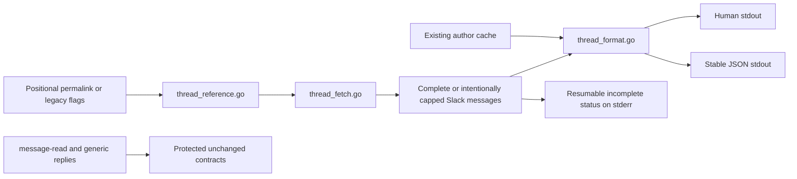

# Exhaustive `thread-read` with Reactions Implementation Plan

> **For agentic workers:** REQUIRED SUB-SKILL: Use superpowers:subagent-driven-development (recommended) or superpowers:executing-plans to implement this plan task-by-task. Steps use checkbox (`- [ ]`) syntax for tracking.

**Goal:** Evolve `thread-read` so one pasted Slack permalink returns the complete requested thread window, including authoritative reaction counts, stable JSON, resumable truncation, and compatible human output.

**Architecture:** Keep `message-read` and the generic `conversations replies` command untouched by introducing thread-specific parsing, retrieval, normalization, and formatting modules in `internal/override`. The Cobra command will validate input before authentication, buffer the complete fetch before writing stdout, reuse cache and exit-code conventions, and emit a success-status warning only when `--max-results` intentionally truncates a thread.

**Tech Stack:** Go 1.26.1, Cobra 1.10.2, slack-go/slack 0.21.1, standard-library `testing`, google/go-cmp 0.7.0

## Global Constraints

- `thread-read` MUST remain the semantic command; no replacement or general-purpose `read` command may be introduced.
- Exactly one input mode MUST be supplied: one positional permalink, `--url`, or `--channel` together with `--ts`.
- The parser MUST accept HTTP or HTTPS Slack permalinks, `C`, `D`, and `G` conversation IDs, strict Slack timestamps, `thread_ts`, and matching `cid` values.
- Retrieval MUST be exhaustive by default and MUST keep `--limit` as page size, `--max-results` as total unique-message capacity, and `--all` as an accepted no-op.
- `--limit=0` MUST use Slack's default unless finite remaining capacity is supplied as the final page limit; `--max-results=0` MUST mean unlimited; the inherited default MUST remain `10000`.
- `--oldest`, `--latest`, `--inclusive`, `--cursor`, and `--include-all-metadata` MUST be carried unchanged across pages, except that each returned cursor replaces the initial cursor.
- Messages MUST be deduplicated and ordered by exact Slack timestamp; every message MUST count once toward `--max-results`, including the parent.
- A repeated cursor, API failure, cancellation, or exhausted rate-limit retries MUST fail without writing a partial thread to stdout.
- With `--wait-on-rate-limit`, the implementation MUST wait cancellably for `Retry-After` and allow three retries after the initial request; a fourth consecutive rate-limit response for the same cursor MUST fail. A successful page MUST reset the counter.
- JSON stdout MUST remain a top-level array and preserve `user`, `ts`, and `text`; `slack_ts` and an always-present `reactions` array are additive.
- Reaction summaries MUST contain only `name` and Slack's authoritative `count`, sorted lexicographically; reactor identities MUST NOT be returned or fetched.
- Metadata MUST appear only in JSON, only when `--include-all-metadata` is set, and only when Slack returned metadata for that message.
- `message-read`, its formatter/schema, `internal/dispatch.Paginate`, and the generic `conversations replies` command MUST NOT change.
- Implementation MUST use BDD Red-Green-Refactor. `make test` and `make lint` MUST pass before completion.
- Every commit MUST include `Co-Authored-By: Peter O'Connor <poconnor@stackoverflow.com>` and `Co-Authored-By: Codex <noreply@anthropic.com> - GPT-5`.
- Each task SHOULD remain a focused review unit; if the complete change exceeds the repository's 300-line PR preference, execution SHOULD use stacked PRs at task boundaries without breaking the working-software sequence.
- Every dispatched specification or code reviewer MUST finish, and all findings MUST be addressed, before the next task begins.

---

## File Structure

| File | Action | Responsibility |
|---|---|---|
| `internal/override/thread_reference.go` | Create | Pure permalink parsing, mutually exclusive input-mode resolution, and retrieval-filter validation. |
| `internal/override/thread_reference_test.go` | Create | BDD coverage for positional/legacy inputs, reply anchoring, IDs, query validation, conflicts, and range validation. |
| `internal/override/thread_fetch.go` | Create | Injectable Slack client boundary, cursor loop, rate-limit waiting, deduplication, ordering, and completeness state. |
| `internal/override/thread_fetch_test.go` | Create | BDD coverage for pages, cursors, limits, retries, cancellation, failures, ordering, and truncation. |
| `internal/override/thread_format.go` | Create | Thread-only normalized model, reaction/metadata normalization, human/JSON formatters, and incomplete-result formatter. |
| `internal/override/thread_format_test.go` | Create | Stable human/JSON snapshots, reaction ordering, metadata omission, author fallback, and write failures. |
| `internal/override/thread_read_cmd.go` | Modify | Compose input parsing, auth, cache, fetching, formatting, incomplete status, and exit classification. |
| `internal/override/thread_read_cmd_test.go` | Replace | Command BDD tests with fake client/cache/wait dependencies and stdout/stderr assertions. |
| `cmd/slack-cli/main.go` | Modify | Keep inherited `--pretty`, `--all`, and `--max-results` help accurate for semantic and generic commands. |
| `internal/override/read_format_test.go` | Modify | Add exact compatibility snapshots proving `message-read`'s formatter did not change. |
| `README.md` | Modify | Document pasted permalinks, exhaustive retrieval, reactions, filters, caps, and output contracts. |
| `skill/SKILL.md` | Modify | Prefer positional `thread-read` and explain resumable completeness. |
| `CONTRIBUTING.md` | Modify | Document the thread-specific boundary and semantic-command testing strategy. |
| `docs/adr/0001-exhaustive-thread-read.md` | Verify | Confirm the accepted MADR remains aligned; edit only if implementation changes an approved decision. |
| `docs/superpowers/specs/2026-07-20-thread-read-reactions-design.md` | Verify | Confirm every acceptance criterion is represented and preserve its existing AI footer. |

The existing `internal/override/slack_url.go` and `internal/override/read_format.go` MUST remain unchanged. They are the compatibility boundary for `message-read`; thread permalinks need stricter, parent-aware behavior and therefore receive dedicated code.



### Task 1: Parse and validate thread references

**Files:**
- Create: `internal/override/thread_reference.go`
- Create: `internal/override/thread_reference_test.go`
- Verify unchanged: `internal/override/slack_url.go`
- Verify unchanged: `internal/override/message_read_cmd.go`

**Interfaces:**
- Consumes: `validate.ChannelID(string) error` and `validate.Timestamp(string) error`.
- Produces: `threadReference{ConversationID string, ThreadTS string}`, `resolveThreadReference(args []string, rawURL, channel, ts string) (threadReference, error)`, `parseThreadPermalink(rawURL string) (threadReference, error)`, and `validateThreadFilters(oldest, latest string, limit, maxResults int) error`.

- [ ] **Step 1: Write the failing reference and input-mode tests**

Create `internal/override/thread_reference_test.go`. These tables MUST be copied exactly so every accepted mode and conflict is executable:

```go
package override

import (
	"strings"
	"testing"

	"github.com/google/go-cmp/cmp"
)

func TestParseThreadPermalink(t *testing.T) {
	tests := []struct {
		name    string
		rawURL  string
		want    threadReference
		wantErr string
	}{
		{
			name:   "public channel root",
			rawURL: "https://stackexchange.slack.com/archives/C09M260TY7Q/p1784131538270229",
			want:   threadReference{ConversationID: "C09M260TY7Q", ThreadTS: "1784131538.270229"},
		},
		{
			name:   "direct message root",
			rawURL: "https://stackexchange.slack.com/archives/D09M260TY7Q/p1784131538270229",
			want:   threadReference{ConversationID: "D09M260TY7Q", ThreadTS: "1784131538.270229"},
		},
		{
			name:   "private conversation root",
			rawURL: "http://stackexchange.slack.com/archives/G09M260TY7Q/p1784131538270229",
			want:   threadReference{ConversationID: "G09M260TY7Q", ThreadTS: "1784131538.270229"},
		},
		{
			name:   "reply uses parent thread timestamp",
			rawURL: "https://stackexchange.slack.com/archives/C09M260TY7Q/p1784131630101010?thread_ts=1784131538.270229&cid=C09M260TY7Q",
			want:   threadReference{ConversationID: "C09M260TY7Q", ThreadTS: "1784131538.270229"},
		},
		{name: "missing scheme", rawURL: "stackexchange.slack.com/archives/C09M260TY7Q/p1784131538270229", wantErr: "http or https"},
		{name: "non Slack host", rawURL: "https://slack.example.com/archives/C09M260TY7Q/p1784131538270229", wantErr: "Slack hostname"},
		{name: "spoofed suffix", rawURL: "https://stackexchange.slack.com.example.org/archives/C09M260TY7Q/p1784131538270229", wantErr: "Slack hostname"},
		{name: "missing archives", rawURL: "https://stackexchange.slack.com/channels/C09M260TY7Q/p1784131538270229", wantErr: "/archives/"},
		{name: "invalid conversation", rawURL: "https://stackexchange.slack.com/archives/E09M260TY7Q/p1784131538270229", wantErr: "invalid channel ID"},
		{name: "malformed path timestamp", rawURL: "https://stackexchange.slack.com/archives/C09M260TY7Q/p1784131538.270229", wantErr: "permalink timestamp"},
		{name: "malformed thread timestamp", rawURL: "https://stackexchange.slack.com/archives/C09M260TY7Q/p1784131630101010?thread_ts=bad", wantErr: "thread_ts"},
		{name: "malformed query escape", rawURL: "https://stackexchange.slack.com/archives/C09M260TY7Q/p1784131630101010?thread_ts=%ZZ", wantErr: "query"},
		{name: "empty thread timestamp", rawURL: "https://stackexchange.slack.com/archives/C09M260TY7Q/p1784131630101010?thread_ts=", wantErr: "thread_ts"},
		{name: "duplicate thread timestamp", rawURL: "https://stackexchange.slack.com/archives/C09M260TY7Q/p1784131630101010?thread_ts=1784131538.270229&thread_ts=1784131538.270229", wantErr: "thread_ts"},
		{name: "invalid cid", rawURL: "https://stackexchange.slack.com/archives/C09M260TY7Q/p1784131630101010?cid=bad", wantErr: "cid"},
		{name: "mismatched cid", rawURL: "https://stackexchange.slack.com/archives/C09M260TY7Q/p1784131630101010?cid=C09M260DIFF", wantErr: "does not match"},
		{name: "duplicate cid", rawURL: "https://stackexchange.slack.com/archives/C09M260TY7Q/p1784131630101010?cid=C09M260TY7Q&cid=C09M260TY7Q", wantErr: "cid"},
	}

	for _, tt := range tests {
		t.Run(tt.name, func(t *testing.T) {
			got, err := parseThreadPermalink(tt.rawURL)
			if tt.wantErr != "" {
				if err == nil || !strings.Contains(err.Error(), tt.wantErr) {
					t.Fatalf("parseThreadPermalink() error = %v, want substring %q", err, tt.wantErr)
				}
				return
			}
			if err != nil {
				t.Fatalf("parseThreadPermalink() error = %v", err)
			}
			if diff := cmp.Diff(tt.want, got); diff != "" {
				t.Errorf("parseThreadPermalink() mismatch (-want +got):\n%s", diff)
			}
		})
	}
}

func TestResolveThreadReference(t *testing.T) {
	permalink := "https://stackexchange.slack.com/archives/C09M260TY7Q/p1784131538270229"
	want := threadReference{ConversationID: "C09M260TY7Q", ThreadTS: "1784131538.270229"}
	tests := []struct {
		name    string
		args    []string
		rawURL  string
		channel string
		ts      string
		want    threadReference
		wantErr string
	}{
		{name: "positional", args: []string{permalink}, want: want},
		{name: "legacy url", rawURL: permalink, want: want},
		{name: "legacy flags", channel: "C09M260TY7Q", ts: "1784131538.270229", want: want},
		{name: "no mode", wantErr: "exactly one"},
		{name: "two positional", args: []string{permalink, permalink}, wantErr: "at most one"},
		{name: "positional and url", args: []string{permalink}, rawURL: permalink, wantErr: "exactly one"},
		{name: "positional and flags", args: []string{permalink}, channel: "C09M260TY7Q", ts: "1784131538.270229", wantErr: "exactly one"},
		{name: "url and flags", rawURL: permalink, channel: "C09M260TY7Q", ts: "1784131538.270229", wantErr: "exactly one"},
		{name: "channel only", channel: "C09M260TY7Q", wantErr: "together"},
		{name: "timestamp only", ts: "1784131538.270229", wantErr: "together"},
		{name: "bare timestamp", args: []string{"1784131538.270229"}, wantErr: "permalink"},
		{name: "invalid channel", channel: "C01", ts: "1784131538.270229", wantErr: "invalid channel ID"},
		{name: "invalid timestamp", channel: "C09M260TY7Q", ts: "1784131538", wantErr: "invalid timestamp"},
	}
	for _, tt := range tests {
		t.Run(tt.name, func(t *testing.T) {
			got, err := resolveThreadReference(tt.args, tt.rawURL, tt.channel, tt.ts)
			if tt.wantErr != "" {
				if err == nil || !strings.Contains(err.Error(), tt.wantErr) {
					t.Fatalf("resolveThreadReference() error = %v, want substring %q", err, tt.wantErr)
				}
				return
			}
			if err != nil {
				t.Fatalf("resolveThreadReference() error = %v", err)
			}
			if diff := cmp.Diff(tt.want, got); diff != "" {
				t.Errorf("resolveThreadReference() mismatch (-want +got):\n%s", diff)
			}
		})
	}
}

func TestValidateThreadFilters(t *testing.T) {
	tests := []struct {
		name       string
		oldest     string
		latest     string
		limit      int
		maxResults int
		wantErr    string
	}{
		{name: "defaults"},
		{name: "range", oldest: "1784131538.270229", latest: "1784131630.101010", limit: 20, maxResults: 100},
		{name: "negative limit", limit: -1, wantErr: "limit"},
		{name: "negative maximum", maxResults: -1, wantErr: "max-results"},
		{name: "invalid oldest", oldest: "yesterday", wantErr: "oldest"},
		{name: "invalid latest", latest: "tomorrow", wantErr: "latest"},
		{name: "reversed range", oldest: "1784131630.101010", latest: "1784131538.270229", wantErr: "must not be after"},
	}
	for _, tt := range tests {
		t.Run(tt.name, func(t *testing.T) {
			err := validateThreadFilters(tt.oldest, tt.latest, tt.limit, tt.maxResults)
			if tt.wantErr == "" && err != nil {
				t.Fatalf("validateThreadFilters() error = %v", err)
			}
			if tt.wantErr != "" && (err == nil || !strings.Contains(err.Error(), tt.wantErr)) {
				t.Fatalf("validateThreadFilters() error = %v, want substring %q", err, tt.wantErr)
			}
		})
	}
}
```

- [ ] **Step 2: Run the tests and verify red**

Run:

```bash
rtk go test -race -count=1 ./internal/override -run 'Test(Parse|Resolve|Validate)Thread' -v
```

Expected: FAIL to compile because the four Task 1 interfaces do not exist.

- [ ] **Step 3: Implement the pure parser and validators**

Create `internal/override/thread_reference.go`:

```go
package override

import (
	"fmt"
	"net/url"
	"regexp"
	"strings"

	"github.com/poconnor/slack-cli/internal/validate"
)

var permalinkTimestampPattern = regexp.MustCompile(`^p(\d{10})(\d{6})$`)

type threadReference struct {
	ConversationID string
	ThreadTS       string
}

func resolveThreadReference(args []string, rawURL, channel, ts string) (threadReference, error) {
	if len(args) > 1 {
		return threadReference{}, fmt.Errorf("thread-read accepts at most one positional permalink")
	}
	hasPositional := len(args) == 1
	hasURL := rawURL != ""
	hasExplicit := channel != "" || ts != ""
	modes := 0
	for _, present := range []bool{hasPositional, hasURL, hasExplicit} {
		if present {
			modes++
		}
	}
	if modes != 1 {
		return threadReference{}, fmt.Errorf("provide exactly one of a positional permalink, --url, or --channel with --ts")
	}
	if hasPositional {
		return parseThreadPermalink(args[0])
	}
	if hasURL {
		return parseThreadPermalink(rawURL)
	}
	if channel == "" || ts == "" {
		return threadReference{}, fmt.Errorf("--channel and --ts must be provided together")
	}
	if err := validate.ChannelID(channel); err != nil {
		return threadReference{}, err
	}
	if err := validate.Timestamp(ts); err != nil {
		return threadReference{}, err
	}
	return threadReference{ConversationID: channel, ThreadTS: ts}, nil
}

func parseThreadPermalink(rawURL string) (threadReference, error) {
	u, err := url.Parse(rawURL)
	if err != nil {
		return threadReference{}, fmt.Errorf("invalid Slack permalink: %w", err)
	}
	if u.Scheme != "http" && u.Scheme != "https" {
		return threadReference{}, fmt.Errorf("invalid Slack permalink: scheme must be http or https")
	}
	if !isSlackHostname(u.Hostname()) {
		return threadReference{}, fmt.Errorf("invalid Slack permalink: expected a Slack hostname")
	}
	parts := strings.Split(strings.Trim(u.Path, "/"), "/")
	if len(parts) != 3 || parts[0] != "archives" {
		return threadReference{}, fmt.Errorf("invalid Slack permalink: expected /archives/<conversation>/<message> path")
	}
	conversationID := parts[1]
	if err := validate.ChannelID(conversationID); err != nil {
		return threadReference{}, err
	}
	match := permalinkTimestampPattern.FindStringSubmatch(parts[2])
	if match == nil {
		return threadReference{}, fmt.Errorf("invalid Slack permalink timestamp %q", parts[2])
	}
	threadTS := match[1] + "." + match[2]

	query, err := url.ParseQuery(u.RawQuery)
	if err != nil {
		return threadReference{}, fmt.Errorf("invalid Slack permalink query: %w", err)
	}
	if value, present, err := singleQueryValue(query, "thread_ts"); err != nil {
		return threadReference{}, err
	} else if present {
		if err := validate.Timestamp(value); err != nil {
			return threadReference{}, fmt.Errorf("invalid thread_ts: %w", err)
		}
		threadTS = value
	}
	if value, present, err := singleQueryValue(query, "cid"); err != nil {
		return threadReference{}, err
	} else if present {
		if err := validate.ChannelID(value); err != nil {
			return threadReference{}, fmt.Errorf("invalid cid: %w", err)
		}
		if value != conversationID {
			return threadReference{}, fmt.Errorf("cid %q does not match path conversation %q", value, conversationID)
		}
	}
	if err := validate.Timestamp(threadTS); err != nil {
		return threadReference{}, err
	}
	return threadReference{ConversationID: conversationID, ThreadTS: threadTS}, nil
}

func isSlackHostname(host string) bool {
	host = strings.ToLower(strings.TrimSuffix(host, "."))
	return host == "slack.com" || strings.HasSuffix(host, ".slack.com")
}

func singleQueryValue(values url.Values, key string) (string, bool, error) {
	items, present := values[key]
	if !present {
		return "", false, nil
	}
	if len(items) != 1 || items[0] == "" {
		return "", false, fmt.Errorf("invalid %s: expected exactly one non-empty value", key)
	}
	return items[0], true, nil
}

func validateThreadFilters(oldest, latest string, limit, maxResults int) error {
	if limit < 0 {
		return fmt.Errorf("--limit must be zero or greater")
	}
	if maxResults < 0 {
		return fmt.Errorf("--max-results must be zero or greater")
	}
	if oldest != "" {
		if err := validate.Timestamp(oldest); err != nil {
			return fmt.Errorf("invalid --oldest: %w", err)
		}
	}
	if latest != "" {
		if err := validate.Timestamp(latest); err != nil {
			return fmt.Errorf("invalid --latest: %w", err)
		}
	}
	if oldest != "" && latest != "" && oldest > latest {
		return fmt.Errorf("--oldest must not be after --latest")
	}
	return nil
}
```

- [ ] **Step 4: Format, verify green, and prove the compatibility boundary**

Run:

```bash
rtk gofmt -w internal/override/thread_reference.go internal/override/thread_reference_test.go
rtk go test -race -count=1 ./internal/override -run 'Test(Parse|Resolve|Validate)Thread' -v
rtk git diff -- internal/override/slack_url.go internal/override/message_read_cmd.go internal/override/read_format.go
rtk go test -race -count=1 ./internal/override -run 'Test(ParseSlackURL|MessageRead|FormatMessages)' -v
```

Expected: all tests PASS and the guarded-file diff is empty.

- [ ] **Step 5: Commit the green parser slice**

```bash
rtk git add internal/override/thread_reference.go internal/override/thread_reference_test.go
rtk git commit -m "feat: validate thread-read references" -m "Co-Authored-By: Peter O'Connor <poconnor@stackoverflow.com>
Co-Authored-By: Codex <noreply@anthropic.com> - GPT-5"
```

- [ ] **Step 6: Complete the task review gate**

The specification reviewer MUST verify all input modes and permalink rules against `docs/superpowers/specs/2026-07-20-thread-read-reactions-design.md:69-115`. The code-quality reviewer MUST verify that `thread_reference.go` has no Slack API dependency and shared `message-read` files are unchanged. Address every finding, rerun Step 4, and obtain approval before Task 2.

### Task 2: Fetch complete thread windows safely

**Files:**
- Create: `internal/override/thread_fetch.go`
- Create: `internal/override/thread_fetch_test.go`
- Verify unchanged: `internal/dispatch/pagination.go`
- Verify unchanged: `internal/dispatch/impl_conversations.go`

**Interfaces:**
- Consumes: `threadReference` and `slack.GetConversationRepliesParameters`.
- Produces: `threadClient`, `threadFetchOptions`, `threadFetchResult`, `fetchThread(context.Context, threadClient, threadReference, threadFetchOptions, threadWaitFunc) (threadFetchResult, error)`, `waitForRetry(context.Context, time.Duration) error`, and `errRepeatedThreadCursor`.

- [ ] **Step 1: Write failing pagination, cap, ordering, and failure tests**

Create `internal/override/thread_fetch_test.go`. The fake MUST copy request parameters before returning each scripted page.

```go
package override

import (
	"context"
	"errors"
	"fmt"
	"testing"
	"time"

	"github.com/google/go-cmp/cmp"
	"github.com/slack-go/slack"
)

type fakeThreadPage struct {
	messages   []slack.Message
	nextCursor string
	err        error
}

type fakeThreadClient struct {
	pages []fakeThreadPage
	calls []slack.GetConversationRepliesParameters
}

func (f *fakeThreadClient) GetConversationRepliesContext(
	_ context.Context,
	params *slack.GetConversationRepliesParameters,
) ([]slack.Message, bool, string, error) {
	f.calls = append(f.calls, *params)
	if len(f.pages) == 0 {
		return nil, false, "", fmt.Errorf("unexpected conversations.replies call")
	}
	page := f.pages[0]
	f.pages = f.pages[1:]
	return page.messages, page.nextCursor != "", page.nextCursor, page.err
}

func slackMessage(ts string) slack.Message {
	return slack.Message{Msg: slack.Msg{Timestamp: ts, Text: ts}}
}

func noWait(context.Context, time.Duration) error { return nil }

func TestFetchThreadPaginatesDeduplicatesSortsAndCarriesFilters(t *testing.T) {
	client := &fakeThreadClient{pages: []fakeThreadPage{
		{messages: []slack.Message{slackMessage("1784131630.101010"), slackMessage("1784131538.270229")}, nextCursor: "page-2"},
		{messages: []slack.Message{slackMessage("1784131630.101010"), slackMessage("1784131700.000001")}},
	}}
	options := threadFetchOptions{
		Cursor: "resume-here", Oldest: "1784131500.000000", Latest: "1784131800.000000",
		Inclusive: true, Limit: 2, MaxResults: 10, IncludeAllMetadata: true,
	}
	got, err := fetchThread(context.Background(), client, threadReference{
		ConversationID: "C09M260TY7Q", ThreadTS: "1784131538.270229",
	}, options, noWait)
	if err != nil {
		t.Fatalf("fetchThread() error = %v", err)
	}
	gotTS := make([]string, len(got.Messages))
	for i, message := range got.Messages {
		gotTS[i] = message.Timestamp
	}
	wantTS := []string{"1784131538.270229", "1784131630.101010", "1784131700.000001"}
	if diff := cmp.Diff(wantTS, gotTS); diff != "" {
		t.Errorf("timestamps mismatch (-want +got):\n%s", diff)
	}
	if !got.Complete || got.NextCursor != "" {
		t.Errorf("complete/cursor = %v/%q, want true/empty", got.Complete, got.NextCursor)
	}
	if len(client.calls) != 2 {
		t.Fatalf("calls = %d, want 2", len(client.calls))
	}
	for i, call := range client.calls {
		if call.ChannelID != "C09M260TY7Q" || call.Timestamp != "1784131538.270229" ||
			call.Oldest != options.Oldest || call.Latest != options.Latest ||
			!call.Inclusive || !call.IncludeAllMetadata || call.Limit != 2 {
			t.Errorf("call %d lost options: %#v", i, call)
		}
	}
	if client.calls[0].Cursor != "resume-here" || client.calls[1].Cursor != "page-2" {
		t.Errorf("cursor sequence = %q, %q", client.calls[0].Cursor, client.calls[1].Cursor)
	}
}

func TestFetchThreadMaximumResultSemantics(t *testing.T) {
	tests := []struct {
		name         string
		options      threadFetchOptions
		pages        []fakeThreadPage
		wantCount    int
		wantComplete bool
		wantCursor   string
		wantLimits   []int
	}{
		{
			name: "exact cap with empty cursor", options: threadFetchOptions{Limit: 2, MaxResults: 2},
			pages: []fakeThreadPage{{messages: []slack.Message{slackMessage("1784131538.270229"), slackMessage("1784131630.101010")}}},
			wantCount: 2, wantComplete: true, wantLimits: []int{2},
		},
		{
			name: "cap with next cursor", options: threadFetchOptions{Limit: 5, MaxResults: 2},
			pages: []fakeThreadPage{{messages: []slack.Message{slackMessage("1784131538.270229"), slackMessage("1784131630.101010")}, nextCursor: "resume"}},
			wantCount: 2, wantCursor: "resume", wantLimits: []int{2},
		},
		{
			name: "remaining capacity shrinks final page", options: threadFetchOptions{Limit: 2, MaxResults: 3},
			pages: []fakeThreadPage{
				{messages: []slack.Message{slackMessage("1784131538.270229"), slackMessage("1784131630.101010")}, nextCursor: "next"},
				{messages: []slack.Message{slackMessage("1784131700.000001")}},
			},
			wantCount: 3, wantComplete: true, wantLimits: []int{2, 1},
		},
		{
			name: "zero limit uses remaining capacity", options: threadFetchOptions{MaxResults: 3},
			pages: []fakeThreadPage{{messages: []slack.Message{slackMessage("1784131538.270229")}}},
			wantCount: 1, wantComplete: true, wantLimits: []int{3},
		},
		{
			name: "zero maximum is unlimited", options: threadFetchOptions{Limit: 2},
			pages: []fakeThreadPage{
				{messages: []slack.Message{slackMessage("1784131538.270229"), slackMessage("1784131630.101010")}, nextCursor: "next"},
				{messages: []slack.Message{slackMessage("1784131700.000001")}},
			},
			wantCount: 3, wantComplete: true, wantLimits: []int{2, 2},
		},
	}
	for _, tt := range tests {
		t.Run(tt.name, func(t *testing.T) {
			client := &fakeThreadClient{pages: tt.pages}
			got, err := fetchThread(context.Background(), client, threadReference{
				ConversationID: "C09M260TY7Q", ThreadTS: "1784131538.270229",
			}, tt.options, noWait)
			if err != nil {
				t.Fatalf("fetchThread() error = %v", err)
			}
			if len(got.Messages) != tt.wantCount || got.Complete != tt.wantComplete || got.NextCursor != tt.wantCursor {
				t.Errorf("result = %d/%v/%q, want %d/%v/%q", len(got.Messages), got.Complete, got.NextCursor, tt.wantCount, tt.wantComplete, tt.wantCursor)
			}
			gotLimits := make([]int, len(client.calls))
			for i, call := range client.calls {
				gotLimits[i] = call.Limit
			}
			if diff := cmp.Diff(tt.wantLimits, gotLimits); diff != "" {
				t.Errorf("limits mismatch (-want +got):\n%s", diff)
			}
		})
	}
}

func TestFetchThreadStandaloneMessageIsComplete(t *testing.T) {
	client := &fakeThreadClient{pages: []fakeThreadPage{{
		messages: []slack.Message{slackMessage("1784131538.270229")},
	}}}
	got, err := fetchThread(context.Background(), client, threadReference{
		ConversationID: "C09M260TY7Q", ThreadTS: "1784131538.270229",
	}, threadFetchOptions{}, noWait)
	if err != nil {
		t.Fatalf("fetchThread() error = %v", err)
	}
	if !got.Complete || got.NextCursor != "" || len(got.Messages) != 1 {
		t.Errorf("result = %d/%v/%q, want 1/true/empty", len(got.Messages), got.Complete, got.NextCursor)
	}
}

func TestFetchThreadRejectsRepeatedCursor(t *testing.T) {
	client := &fakeThreadClient{pages: []fakeThreadPage{
		{messages: []slack.Message{slackMessage("1784131538.270229")}, nextCursor: "repeat"},
		{messages: []slack.Message{slackMessage("1784131630.101010")}, nextCursor: "repeat"},
	}}
	got, err := fetchThread(context.Background(), client, threadReference{
		ConversationID: "C09M260TY7Q", ThreadTS: "1784131538.270229",
	}, threadFetchOptions{}, noWait)
	if !errors.Is(err, errRepeatedThreadCursor) {
		t.Fatalf("error = %v, want errRepeatedThreadCursor", err)
	}
	if len(got.Messages) != 0 {
		t.Fatalf("returned %d partial messages", len(got.Messages))
	}
}

func TestFetchThreadRateLimitPolicy(t *testing.T) {
	rateLimit := &slack.RateLimitedError{RetryAfter: 25 * time.Millisecond}
	tests := []struct {
		name        string
		wait        bool
		pages       []fakeThreadPage
		wantCalls   int
		wantWaits   int
		wantErr     bool
		wantMessage int
	}{
		{name: "no wait", pages: []fakeThreadPage{{err: rateLimit}}, wantCalls: 1, wantErr: true},
		{
			name: "wait and succeed", wait: true,
			pages: []fakeThreadPage{{err: rateLimit}, {err: rateLimit}, {messages: []slack.Message{slackMessage("1784131538.270229")}}},
			wantCalls: 3, wantWaits: 2, wantMessage: 1,
		},
		{
			name: "fourth response exhausts three retries", wait: true,
			pages: []fakeThreadPage{{err: rateLimit}, {err: rateLimit}, {err: rateLimit}, {err: rateLimit}},
			wantCalls: 4, wantWaits: 3, wantErr: true,
		},
	}
	for _, tt := range tests {
		t.Run(tt.name, func(t *testing.T) {
			client := &fakeThreadClient{pages: tt.pages}
			waits := 0
			wait := func(_ context.Context, delay time.Duration) error {
				waits++
				if delay != 25*time.Millisecond {
					t.Errorf("delay = %s, want 25ms", delay)
				}
				return nil
			}
			got, err := fetchThread(context.Background(), client, threadReference{
				ConversationID: "C09M260TY7Q", ThreadTS: "1784131538.270229",
			}, threadFetchOptions{WaitOnRateLimit: tt.wait}, wait)
			if (err != nil) != tt.wantErr {
				t.Fatalf("error = %v, wantErr %v", err, tt.wantErr)
			}
			if len(client.calls) != tt.wantCalls || waits != tt.wantWaits || len(got.Messages) != tt.wantMessage {
				t.Errorf("calls/waits/messages = %d/%d/%d, want %d/%d/%d", len(client.calls), waits, len(got.Messages), tt.wantCalls, tt.wantWaits, tt.wantMessage)
			}
		})
	}
}

func TestWaitForRetryIsCancellable(t *testing.T) {
	ctx, cancel := context.WithCancel(context.Background())
	cancel()
	if err := waitForRetry(ctx, time.Hour); !errors.Is(err, context.Canceled) {
		t.Fatalf("error = %v, want context.Canceled", err)
	}
}

func TestFetchThreadRateLimitRetryCountResetsAfterSuccessfulPage(t *testing.T) {
	rateLimit := &slack.RateLimitedError{RetryAfter: time.Millisecond}
	client := &fakeThreadClient{pages: []fakeThreadPage{
		{err: rateLimit},
		{err: rateLimit},
		{err: rateLimit},
		{messages: []slack.Message{slackMessage("1784131538.270229")}, nextCursor: "next"},
		{err: rateLimit},
		{err: rateLimit},
		{err: rateLimit},
		{messages: []slack.Message{slackMessage("1784131630.101010")}},
	}}
	waits := 0
	got, err := fetchThread(context.Background(), client, threadReference{
		ConversationID: "C09M260TY7Q", ThreadTS: "1784131538.270229",
	}, threadFetchOptions{WaitOnRateLimit: true}, func(context.Context, time.Duration) error {
		waits++
		return nil
	})
	if err != nil {
		t.Fatalf("fetchThread() error = %v", err)
	}
	if waits != 6 || len(got.Messages) != 2 || !got.Complete {
		t.Errorf("waits/messages/complete = %d/%d/%v, want 6/2/true", waits, len(got.Messages), got.Complete)
	}
}

func TestFetchThreadLaterPageFailureReturnsNoPartialResult(t *testing.T) {
	client := &fakeThreadClient{pages: []fakeThreadPage{
		{messages: []slack.Message{slackMessage("1784131538.270229")}, nextCursor: "next"},
		{err: slack.SlackErrorResponse{Err: "thread_not_found"}},
	}}
	got, err := fetchThread(context.Background(), client, threadReference{
		ConversationID: "C09M260TY7Q", ThreadTS: "1784131538.270229",
	}, threadFetchOptions{}, noWait)
	if err == nil {
		t.Fatal("error = nil")
	}
	if len(got.Messages) != 0 {
		t.Fatalf("returned %d partial messages", len(got.Messages))
	}
}
```

- [ ] **Step 2: Run the tests and verify red**

Run:

```bash
rtk go test -race -count=1 ./internal/override -run 'Test(FetchThread|WaitForRetry)' -v
```

Expected: FAIL to compile because the Task 2 interfaces do not exist.

- [ ] **Step 3: Implement the dedicated retrieval loop**

Create `internal/override/thread_fetch.go`:

```go
package override

import (
	"context"
	"errors"
	"fmt"
	"sort"
	"time"

	"github.com/slack-go/slack"
)

const maxConsecutiveRateLimitRetries = 3

var errRepeatedThreadCursor = errors.New("repeated thread pagination cursor")

type threadClient interface {
	GetConversationRepliesContext(context.Context, *slack.GetConversationRepliesParameters) ([]slack.Message, bool, string, error)
}

type threadWaitFunc func(context.Context, time.Duration) error

type threadFetchOptions struct {
	Cursor             string
	Oldest             string
	Latest             string
	Inclusive          bool
	Limit              int
	MaxResults         int
	IncludeAllMetadata bool
	WaitOnRateLimit    bool
}

type threadFetchResult struct {
	Messages   []slack.Message
	Complete   bool
	NextCursor string
}

func fetchThread(
	ctx context.Context,
	client threadClient,
	reference threadReference,
	options threadFetchOptions,
	wait threadWaitFunc,
) (threadFetchResult, error) {
	unique := make(map[string]slack.Message)
	requestedCursors := make(map[string]struct{})
	cursor := options.Cursor

	for {
		if _, repeated := requestedCursors[cursor]; repeated {
			return threadFetchResult{}, fmt.Errorf("%w: %q", errRepeatedThreadCursor, cursor)
		}
		requestedCursors[cursor] = struct{}{}

		params := &slack.GetConversationRepliesParameters{
			ChannelID: reference.ConversationID, Timestamp: reference.ThreadTS, Cursor: cursor,
			Inclusive: options.Inclusive, Latest: options.Latest,
			Limit: threadPageLimit(options.Limit, options.MaxResults, len(unique)),
			Oldest: options.Oldest, IncludeAllMetadata: options.IncludeAllMetadata,
		}
		messages, nextCursor, err := fetchThreadPage(ctx, client, params, options.WaitOnRateLimit, wait)
		if err != nil {
			return threadFetchResult{}, err
		}
		for _, message := range messages {
			if _, exists := unique[message.Timestamp]; exists {
				continue
			}
			unique[message.Timestamp] = message
			if options.MaxResults > 0 && len(unique) == options.MaxResults {
				break
			}
		}
		if nextCursor == "" {
			return threadFetchResult{Messages: sortedThreadMessages(unique), Complete: true}, nil
		}
		if options.MaxResults > 0 && len(unique) == options.MaxResults {
			return threadFetchResult{
				Messages: sortedThreadMessages(unique), Complete: false, NextCursor: nextCursor,
			}, nil
		}
		cursor = nextCursor
	}
}

func fetchThreadPage(
	ctx context.Context,
	client threadClient,
	params *slack.GetConversationRepliesParameters,
	waitOnRateLimit bool,
	wait threadWaitFunc,
) ([]slack.Message, string, error) {
	retries := 0
	for {
		messages, _, nextCursor, err := client.GetConversationRepliesContext(ctx, params)
		if err == nil {
			return messages, nextCursor, nil
		}
		var rateLimited *slack.RateLimitedError
		if !errors.As(err, &rateLimited) || !waitOnRateLimit {
			return nil, "", err
		}
		if retries == maxConsecutiveRateLimitRetries {
			return nil, "", err
		}
		retries++
		if err := wait(ctx, rateLimited.RetryAfter); err != nil {
			return nil, "", err
		}
	}
}

func threadPageLimit(limit, maxResults, selected int) int {
	if maxResults == 0 {
		return limit
	}
	remaining := maxResults - selected
	if limit == 0 || remaining < limit {
		return remaining
	}
	return limit
}

func sortedThreadMessages(unique map[string]slack.Message) []slack.Message {
	messages := make([]slack.Message, 0, len(unique))
	for _, message := range unique {
		messages = append(messages, message)
	}
	sort.Slice(messages, func(i, j int) bool {
		return messages[i].Timestamp < messages[j].Timestamp
	})
	return messages
}

func waitForRetry(ctx context.Context, delay time.Duration) error {
	timer := time.NewTimer(delay)
	defer timer.Stop()
	select {
	case <-ctx.Done():
		return ctx.Err()
	case <-timer.C:
		return nil
	}
}
```

- [ ] **Step 4: Format, verify green, and prove the generic paginator is untouched**

Run:

```bash
rtk gofmt -w internal/override/thread_fetch.go internal/override/thread_fetch_test.go
rtk go test -race -count=1 ./internal/override -run 'Test(FetchThread|WaitForRetry)' -v
rtk go test -race -count=1 ./internal/override -v
rtk git diff -- internal/dispatch/pagination.go internal/dispatch/impl_conversations.go
rtk go test -race -count=1 ./internal/dispatch -run 'TestPaginate' -v
```

Expected: all tests PASS and the guarded dispatch-file diff is empty.

- [ ] **Step 5: Commit the green retrieval slice**

```bash
rtk git add internal/override/thread_fetch.go internal/override/thread_fetch_test.go
rtk git commit -m "feat: fetch complete Slack thread windows" -m "Co-Authored-By: Peter O'Connor <poconnor@stackoverflow.com>
Co-Authored-By: Codex <noreply@anthropic.com> - GPT-5"
```

- [ ] **Step 6: Complete the task review gate**

The specification reviewer MUST trace `docs/superpowers/specs/2026-07-20-thread-read-reactions-design.md:145-213` to tests. The code-quality reviewer MUST inspect cursor repetition, deduplication, page-size calculations, result buffering, and cancellable timers. Address every finding, rerun Step 4, and obtain approval before Task 3.


### Task 3: Normalize and format thread-only messages

**Files:**
- Create: `internal/override/thread_format.go`
- Create: `internal/override/thread_format_test.go`
- Modify: `internal/override/read_format_test.go:49-84`
- Verify unchanged: `internal/override/read_format.go`

**Interfaces:**
- Consumes: `[]slack.Message`, existing `resolveUser` and `parseSlackTimestamp` helpers, the ID-to-name map, and `threadFetchResult`.
- Produces: `threadReaction`, `threadMessage`, `normalizeThreadMessages`, `formatThreadMessages`, and `writeThreadIncompleteStatus`.

- [ ] **Step 1: Write failing normalization and formatter snapshots**

Create `internal/override/thread_format_test.go`:

```go
package override

import (
	"bytes"
	"encoding/json"
	"testing"
	"time"

	"github.com/google/go-cmp/cmp"
	"github.com/slack-go/slack"
)

func TestNormalizeThreadMessagesSortsReactionsAndResolvesAuthors(t *testing.T) {
	source := []slack.Message{
		{Msg: slack.Msg{
			User: "U09PETER01", Timestamp: "1784131538.270229", Text: "Deployment complete",
			Reactions: []slack.ItemReaction{
				{Name: "white_check_mark", Count: 4, Users: []string{"U01"}},
				{Name: "eyes", Count: 2, Users: []string{"U01", "U02"}},
			},
			Metadata: slack.SlackMetadata{
				EventType: "deployment_completed", EventPayload: map[string]any{},
			},
		}},
		{Msg: slack.Msg{BotID: "B09BOT000", Timestamp: "1784131630.101010", Text: "Bot reply"}},
		{Msg: slack.Msg{User: "U09UNKNOWN", Timestamp: "1784131700.000001", Text: "Unknown reply"}},
	}

	got := normalizeThreadMessages(source, map[string]string{"U09PETER01": "Peter O'Connor"}, true)
	if got[0].User != "Peter O'Connor" || got[1].User != "[bot]" || got[2].User != "U09UNKNOWN" {
		t.Fatalf("author fallbacks = %q, %q, %q", got[0].User, got[1].User, got[2].User)
	}
	wantReactions := []threadReaction{
		{Name: "eyes", Count: 2},
		{Name: "white_check_mark", Count: 4},
	}
	if diff := cmp.Diff(wantReactions, got[0].Reactions); diff != "" {
		t.Errorf("reactions mismatch (-want +got):\n%s", diff)
	}
	if got[0].Metadata == nil || got[0].Metadata.EventType != "deployment_completed" {
		t.Errorf("metadata = %#v", got[0].Metadata)
	}
	if got[1].Reactions == nil || got[2].Reactions == nil {
		t.Error("messages without reactions MUST use non-nil empty slices")
	}
	if len(source[0].Reactions[0].Users) != 1 {
		t.Error("normalization mutated the SDK message")
	}
}

func TestNormalizeThreadMessagesOmitsUnrequestedAndEmptyMetadata(t *testing.T) {
	withMetadata := []slack.Message{{Msg: slack.Msg{
		Timestamp: "1784131538.270229",
		Metadata: slack.SlackMetadata{
			EventType: "deployment_completed", EventPayload: map[string]any{},
		},
	}}}
	if got := normalizeThreadMessages(withMetadata, nil, false); got[0].Metadata != nil {
		t.Fatalf("unrequested metadata = %#v, want nil", got[0].Metadata)
	}

	withoutMetadata := []slack.Message{{Msg: slack.Msg{Timestamp: "1784131538.270229"}}}
	if got := normalizeThreadMessages(withoutMetadata, nil, true); got[0].Metadata != nil {
		t.Fatalf("empty metadata = %#v, want nil", got[0].Metadata)
	}
}

func TestFormatThreadMessagesHumanSnapshot(t *testing.T) {
	location := time.FixedZone("EDT", -4*60*60)
	previousLocation := time.Local
	time.Local = location
	t.Cleanup(func() { time.Local = previousLocation })
	messages := []threadMessage{
		{
			User: "Peter O'Connor", Time: time.Date(2026, 7, 15, 13, 5, 38, 0, location),
			SlackTS: "1784131538.270229", Text: "The deployment is complete.",
			Reactions: []threadReaction{
				{Name: "eyes", Count: 2},
				{Name: "white_check_mark", Count: 4},
			},
		},
		{
			User: "Brendan Rosage", Time: time.Date(2026, 7, 15, 13, 7, 10, 0, location),
			SlackTS: "1784131630.101010", Text: "Confirmed.", Reactions: []threadReaction{},
		},
	}
	var out bytes.Buffer
	if err := formatThreadMessages(messages, false, &out); err != nil {
		t.Fatalf("formatThreadMessages() error = %v", err)
	}
	want := "Peter O'Connor [2026-07-15 13:05]: The deployment is complete.\n" +
		"  Reactions: :eyes: 2, :white_check_mark: 4\n" +
		"Brendan Rosage [2026-07-15 13:07]: Confirmed.\n"
	if diff := cmp.Diff(want, out.String()); diff != "" {
		t.Errorf("human output mismatch (-want +got):\n%s", diff)
	}
}

func TestFormatThreadMessagesJSONSnapshot(t *testing.T) {
	location := time.FixedZone("EDT", -4*60*60)
	messages := []threadMessage{
		{
			User: "Peter O'Connor", Time: time.Date(2026, 7, 15, 13, 5, 38, 0, location),
			SlackTS: "1784131538.270229", Text: "The deployment is complete.",
			Reactions: []threadReaction{{Name: "eyes", Count: 2}},
			Metadata: &slack.SlackMetadata{
				EventType: "deployment_completed", EventPayload: map[string]any{},
			},
		},
		{
			User: "Brendan Rosage", Time: time.Date(2026, 7, 15, 13, 7, 10, 0, location),
			SlackTS: "1784131630.101010", Text: "Confirmed.", Reactions: []threadReaction{},
		},
	}
	var out bytes.Buffer
	if err := formatThreadMessages(messages, true, &out); err != nil {
		t.Fatalf("formatThreadMessages() error = %v", err)
	}
	var got []map[string]any
	if err := json.Unmarshal(out.Bytes(), &got); err != nil {
		t.Fatalf("JSON output = %q: %v", out.String(), err)
	}
	if _, present := got[1]["metadata"]; present {
		t.Error("metadata unexpectedly present on second message")
	}
	if reactions, ok := got[1]["reactions"].([]any); !ok || len(reactions) != 0 {
		t.Errorf("empty reactions = %#v, want []", got[1]["reactions"])
	}
	if got[0]["slack_ts"] != "1784131538.270229" ||
		got[0]["user"] != "Peter O'Connor" ||
		got[0]["text"] != "The deployment is complete." {
		t.Errorf("stable fields = %#v", got[0])
	}
	metadata, ok := got[0]["metadata"].(map[string]any)
	if !ok || metadata["event_type"] != "deployment_completed" {
		t.Errorf("metadata = %#v", got[0]["metadata"])
	}
}

func TestWriteThreadIncompleteStatus(t *testing.T) {
	tests := []struct {
		name string
		json bool
		want string
	}{
		{
			name: "human",
			want: "Warning: result limited by --max-results; resume with --cursor dXNlcjp...\n",
		},
		{
			name: "json", json: true,
			want: "{\n  \"complete\": false,\n  \"reason\": \"max_results\",\n  \"next_cursor\": \"dXNlcjp...\"\n}\n",
		},
	}
	for _, tt := range tests {
		t.Run(tt.name, func(t *testing.T) {
			var out bytes.Buffer
			if err := writeThreadIncompleteStatus(&out, tt.json, "dXNlcjp..."); err != nil {
				t.Fatalf("writeThreadIncompleteStatus() error = %v", err)
			}
			if diff := cmp.Diff(tt.want, out.String()); diff != "" {
				t.Errorf("status mismatch (-want +got):\n%s", diff)
			}
		})
	}
}

func TestThreadFormattersPropagateWriteErrors(t *testing.T) {
	messages := []threadMessage{{User: "Peter", Time: time.Now(), Reactions: []threadReaction{}}}
	if err := formatThreadMessages(messages, false, &errWriter{}); err == nil {
		t.Error("human formatter error = nil")
	}
	if err := formatThreadMessages(messages, true, &errWriter{}); err == nil {
		t.Error("JSON formatter error = nil")
	}
	if err := writeThreadIncompleteStatus(&errWriter{}, false, "next"); err == nil {
		t.Error("status formatter error = nil")
	}
}
```

- [ ] **Step 2: Run the formatter tests and verify red**

Run:

```bash
rtk go test -race -count=1 ./internal/override -run 'Test(NormalizeThread|FormatThread|WriteThread|ThreadFormatters)' -v
```

Expected: FAIL to compile because the Task 3 types and functions do not exist.

- [ ] **Step 3: Implement the normalized model and formatters**

Create `internal/override/thread_format.go`:

```go
package override

import (
	"encoding/json"
	"fmt"
	"io"
	"sort"
	"strings"
	"time"

	"github.com/slack-go/slack"
)

type threadReaction struct {
	Name  string `json:"name"`
	Count int    `json:"count"`
}

type threadMessage struct {
	User      string
	Time      time.Time
	SlackTS   string
	Text      string
	Reactions []threadReaction
	Metadata  *slack.SlackMetadata
}

type threadMessageJSON struct {
	User      string               `json:"user"`
	TS        string               `json:"ts"`
	SlackTS   string               `json:"slack_ts"`
	Text      string               `json:"text"`
	Reactions []threadReaction     `json:"reactions"`
	Metadata  *slack.SlackMetadata `json:"metadata,omitempty"`
}

type threadIncompleteStatus struct {
	Complete   bool   `json:"complete"`
	Reason     string `json:"reason"`
	NextCursor string `json:"next_cursor"`
}

func normalizeThreadMessages(
	messages []slack.Message,
	idMap map[string]string,
	includeMetadata bool,
) []threadMessage {
	normalized := make([]threadMessage, 0, len(messages))
	for _, message := range messages {
		reactions := make([]threadReaction, len(message.Reactions))
		for i, reaction := range message.Reactions {
			reactions[i] = threadReaction{Name: reaction.Name, Count: reaction.Count}
		}
		sort.Slice(reactions, func(i, j int) bool {
			return reactions[i].Name < reactions[j].Name
		})

		var metadata *slack.SlackMetadata
		if includeMetadata && hasSlackMetadata(message.Metadata) {
			copy := message.Metadata
			metadata = &copy
		}
		normalized = append(normalized, threadMessage{
			User: resolveUser(message.User, message.BotID, idMap),
			Time: parseSlackTimestamp(message.Timestamp),
			SlackTS: message.Timestamp,
			Text: message.Text,
			Reactions: reactions,
			Metadata: metadata,
		})
	}
	return normalized
}

func hasSlackMetadata(metadata slack.SlackMetadata) bool {
	return metadata.EventType != "" || metadata.EventPayload != nil
}

func formatThreadMessages(messages []threadMessage, asJSON bool, writer io.Writer) error {
	if asJSON {
		out := make([]threadMessageJSON, len(messages))
		for i, message := range messages {
			out[i] = threadMessageJSON{
				User: message.User, TS: message.Time.Format(time.RFC3339),
				SlackTS: message.SlackTS, Text: message.Text,
				Reactions: message.Reactions, Metadata: message.Metadata,
			}
		}
		encoder := json.NewEncoder(writer)
		encoder.SetIndent("", "  ")
		return encoder.Encode(out)
	}

	for _, message := range messages {
		localTime := message.Time.Local().Format("2006-01-02 15:04")
		if _, err := fmt.Fprintf(writer, "%s [%s]: %s\n", message.User, localTime, message.Text); err != nil {
			return err
		}
		if len(message.Reactions) == 0 {
			continue
		}
		parts := make([]string, len(message.Reactions))
		for i, reaction := range message.Reactions {
			parts[i] = fmt.Sprintf(":%s: %d", reaction.Name, reaction.Count)
		}
		if _, err := fmt.Fprintf(writer, "  Reactions: %s\n", strings.Join(parts, ", ")); err != nil {
			return err
		}
	}
	return nil
}

func writeThreadIncompleteStatus(writer io.Writer, asJSON bool, nextCursor string) error {
	if asJSON {
		encoder := json.NewEncoder(writer)
		encoder.SetIndent("", "  ")
		return encoder.Encode(threadIncompleteStatus{
			Complete: false, Reason: "max_results", NextCursor: nextCursor,
		})
	}
	_, err := fmt.Fprintf(
		writer,
		"Warning: result limited by --max-results; resume with --cursor %s\n",
		nextCursor,
	)
	return err
}
```

- [ ] **Step 4: Freeze the unchanged `message-read` schema**

Append this exact test to `internal/override/read_format_test.go` and add `github.com/google/go-cmp/cmp` to the third-party import group:

```go
func TestMessageReadFormatterCompatibilitySnapshot(t *testing.T) {
	location := time.FixedZone("EDT", -4*60*60)
	previousLocation := time.Local
	time.Local = location
	t.Cleanup(func() { time.Local = previousLocation })
	messages := []readMessage{{
		User: "Peter O'Connor",
		Time: time.Date(2026, 7, 15, 13, 5, 38, 0, location),
		Text: "The deployment is complete.",
	}}

	var human bytes.Buffer
	if err := formatMessages(messages, false, &human); err != nil {
		t.Fatalf("formatMessages(human) error = %v", err)
	}
	wantHuman := "Peter O'Connor [2026-07-15 13:05]: The deployment is complete.\n"
	if human.String() != wantHuman {
		t.Errorf("human output = %q, want %q", human.String(), wantHuman)
	}

	var encoded bytes.Buffer
	if err := formatMessages(messages, true, &encoded); err != nil {
		t.Fatalf("formatMessages(JSON) error = %v", err)
	}
	var got []map[string]any
	if err := json.Unmarshal(encoded.Bytes(), &got); err != nil {
		t.Fatalf("JSON output = %q: %v", encoded.String(), err)
	}
	wantJSON := []map[string]any{{
		"user": "Peter O'Connor",
		"ts": "2026-07-15T13:05:38-04:00",
		"text": "The deployment is complete.",
	}}
	if diff := cmp.Diff(wantJSON, got); diff != "" {
		t.Errorf("message-read JSON changed (-want +got):\n%s", diff)
	}
}
```

- [ ] **Step 5: Format, verify green, and run compatibility tests**

Run:

```bash
rtk gofmt -w internal/override/thread_format.go internal/override/thread_format_test.go internal/override/read_format_test.go
rtk go test -race -count=1 ./internal/override -run 'Test(NormalizeThread|FormatThread|WriteThread|ThreadFormatters|MessageReadFormatter)' -v
rtk go test -race -count=1 ./internal/override -v
rtk git diff -- internal/override/read_format.go
```

Expected: all tests PASS and `read_format.go` has no diff.

- [ ] **Step 6: Commit the green output-contract slice**

```bash
rtk git add internal/override/thread_format.go internal/override/thread_format_test.go internal/override/read_format_test.go
rtk git commit -m "feat: format thread reactions and metadata" -m "Co-Authored-By: Peter O'Connor <poconnor@stackoverflow.com>
Co-Authored-By: Codex <noreply@anthropic.com> - GPT-5"
```

- [ ] **Step 7: Complete the task review gate**

The specification reviewer MUST compare snapshots with `docs/superpowers/specs/2026-07-20-thread-read-reactions-design.md:215-329`. The code-quality reviewer MUST confirm reactor IDs cannot enter output, JSON reactions cannot become `null`, metadata cannot enter human output, and `read_format.go` is unchanged. Address every finding, rerun Step 5, and obtain approval before Task 4.

### Task 4: Compose the semantic Cobra command

**Files:**
- Modify: `internal/override/thread_read_cmd.go:1-86`
- Replace: `internal/override/thread_read_cmd_test.go:1-61`
- Modify: `cmd/slack-cli/main.go:58-65`
- Verify unchanged: `internal/override/api_list.go:19-32`

**Interfaces:**
- Consumes: all Task 1-3 interfaces, `cache.LoadIDToNameMap`, `warnIfCacheNotReady`, `formatAndExit`, and `exitcode.Classify`.
- Produces: `threadReadDependencies`, `newThreadReadCmdWithDependencies`, updated `newThreadReadCmd(*slack.Client)`, and `runThreadRead(*cobra.Command, []string, threadReadDependencies) error`.

- [ ] **Step 1: Replace shallow command tests with injectable BDD tests**

Replace `internal/override/thread_read_cmd_test.go` with:

```go
package override

import (
	"bytes"
	"context"
	"encoding/json"
	"errors"
	"strings"
	"testing"

	"github.com/poconnor/slack-cli/internal/dispatch"
	"github.com/poconnor/slack-cli/internal/exitcode"
	"github.com/slack-go/slack"
	"github.com/spf13/cobra"
)

func newThreadReadTestRoot(dependencies threadReadDependencies) *cobra.Command {
	root := &cobra.Command{Use: "slack-cli", SilenceUsage: true, SilenceErrors: true}
	flags := root.PersistentFlags()
	flags.Bool("pretty", false, "")
	flags.Bool("all", false, "")
	flags.Int("limit", 0, "")
	flags.String("cursor", "", "")
	flags.Bool("wait-on-rate-limit", false, "")
	flags.Int("max-results", 10000, "")
	root.AddCommand(newThreadReadCmdWithDependencies(dependencies))
	return root
}

func executeThreadRead(
	t *testing.T,
	dependencies threadReadDependencies,
	args ...string,
) (stdout, stderr string, err error) {
	t.Helper()
	root := newThreadReadTestRoot(dependencies)
	var out, errOut bytes.Buffer
	root.SetOut(&out)
	root.SetErr(&errOut)
	root.SetArgs(append([]string{"thread-read"}, args...))
	err = root.Execute()
	return out.String(), errOut.String(), err
}

func successfulThreadDependencies(client threadClient) threadReadDependencies {
	return threadReadDependencies{
		client: client,
		warnCache: func(*cobra.Command) {},
		loadIDToNameMap: func() (map[string]string, error) {
			return map[string]string{"U09PETER01": "Peter O'Connor"}, nil
		},
		wait: noWait,
	}
}

func TestThreadReadPreferredAndLegacyInputs(t *testing.T) {
	permalink := "https://stackexchange.slack.com/archives/C09M260TY7Q/p1784131538270229"
	tests := []struct {
		name string
		args []string
	}{
		{name: "positional", args: []string{permalink}},
		{name: "url", args: []string{"--url", permalink}},
		{name: "flags", args: []string{"--channel", "C09M260TY7Q", "--ts", "1784131538.270229"}},
		{name: "redundant all with human pretty", args: []string{permalink, "--all", "--pretty"}},
	}
	for _, tt := range tests {
		t.Run(tt.name, func(t *testing.T) {
			client := &fakeThreadClient{pages: []fakeThreadPage{{messages: []slack.Message{{
				Msg: slack.Msg{
					User: "U09PETER01", Timestamp: "1784131538.270229",
					Text: "Deployment complete",
					Reactions: []slack.ItemReaction{{Name: "eyes", Count: 2, Users: []string{"U01"}}},
				},
			}}}}}
			stdout, stderr, err := executeThreadRead(t, successfulThreadDependencies(client), tt.args...)
			if err != nil {
				t.Fatalf("error = %v, stderr = %s", err, stderr)
			}
			if stderr != "" {
				t.Errorf("stderr = %q, want empty", stderr)
			}
			if !strings.Contains(stdout, "Peter O'Connor") ||
				!strings.Contains(stdout, "  Reactions: :eyes: 2") {
				t.Errorf("stdout = %q", stdout)
			}
			if len(client.calls) != 1 ||
				client.calls[0].ChannelID != "C09M260TY7Q" ||
				client.calls[0].Timestamp != "1784131538.270229" {
				t.Errorf("Slack calls = %#v", client.calls)
			}
		})
	}
}

func TestThreadReadReplyPermalinkAnchorsAtParent(t *testing.T) {
	client := &fakeThreadClient{pages: []fakeThreadPage{{
		messages: []slack.Message{slackMessage("1784131538.270229")},
	}}}
	permalink := "https://stackexchange.slack.com/archives/C09M260TY7Q/p1784131630101010?thread_ts=1784131538.270229&cid=C09M260TY7Q"
	_, stderr, err := executeThreadRead(t, successfulThreadDependencies(client), permalink)
	if err != nil {
		t.Fatalf("error = %v, stderr = %s", err, stderr)
	}
	if got := client.calls[0].Timestamp; got != "1784131538.270229" {
		t.Errorf("thread timestamp = %q, want parent", got)
	}
}

func TestThreadReadInputErrorsUseJSONEnvelopeBeforeAuth(t *testing.T) {
	permalink := "https://stackexchange.slack.com/archives/C09M260TY7Q/p1784131538270229"
	tests := []struct {
		name string
		args []string
	}{
		{name: "no mode"},
		{name: "too many arguments", args: []string{permalink, permalink}},
		{name: "mode conflict", args: []string{permalink, "--url", permalink}},
		{name: "missing timestamp", args: []string{"--channel", "C09M260TY7Q"}},
		{name: "negative limit", args: []string{permalink, "--limit", "-1"}},
		{name: "non-integer limit", args: []string{permalink, "--limit", "many"}},
		{name: "negative maximum", args: []string{permalink, "--max-results", "-1"}},
		{
			name: "reversed range",
			args: []string{
				permalink, "--oldest", "1784131700.000001",
				"--latest", "1784131538.270229",
			},
		},
	}
	for _, tt := range tests {
		t.Run(tt.name, func(t *testing.T) {
			stdout, stderr, err := executeThreadRead(t, threadReadDependencies{}, tt.args...)
			if dispatch.ExitCode(err) != exitcode.InputError {
				t.Fatalf("exit code = %d, want %d", dispatch.ExitCode(err), exitcode.InputError)
			}
			if stdout != "" {
				t.Errorf("stdout = %q, want empty", stdout)
			}
			var envelope struct {
				OK       bool   `json:"ok"`
				Error    string `json:"error"`
				ExitCode int    `json:"exit_code"`
			}
			if json.Unmarshal([]byte(stderr), &envelope) != nil ||
				envelope.OK || envelope.ExitCode != exitcode.InputError {
				t.Errorf("stderr = %q, want input-error JSON envelope", stderr)
			}
		})
	}
}

func TestThreadReadValidInputWithoutClientReturnsAuthError(t *testing.T) {
	permalink := "https://stackexchange.slack.com/archives/C09M260TY7Q/p1784131538270229"
	stdout, stderr, err := executeThreadRead(t, threadReadDependencies{}, permalink)
	if stdout != "" ||
		dispatch.ExitCode(err) != exitcode.AuthError ||
		!strings.Contains(stderr, "SLACK_TOKEN") {
		t.Fatalf("stdout/stderr/code = %q/%q/%d", stdout, stderr, dispatch.ExitCode(err))
	}
}

func TestThreadReadJSONTakesPrecedenceAndReportsIncompleteResult(t *testing.T) {
	client := &fakeThreadClient{pages: []fakeThreadPage{{
		messages: []slack.Message{slackMessage("1784131538.270229")},
		nextCursor: "resume-cursor",
	}}}
	stdout, stderr, err := executeThreadRead(
		t,
		successfulThreadDependencies(client),
		"https://stackexchange.slack.com/archives/C09M260TY7Q/p1784131538270229",
		"--json", "--pretty", "--max-results", "1",
	)
	if err != nil {
		t.Fatalf("error = %v", err)
	}
	var messages []map[string]any
	if err := json.Unmarshal([]byte(stdout), &messages); err != nil || len(messages) != 1 {
		t.Fatalf("stdout = %q: %v", stdout, err)
	}
	if _, present := messages[0]["slack_ts"]; !present {
		t.Errorf("stdout lacks slack_ts: %s", stdout)
	}
	var status threadIncompleteStatus
	if err := json.Unmarshal([]byte(stderr), &status); err != nil {
		t.Fatalf("stderr = %q: %v", stderr, err)
	}
	if status.Complete || status.Reason != "max_results" || status.NextCursor != "resume-cursor" {
		t.Errorf("status = %#v", status)
	}
}

func TestThreadReadHumanReportsIncompleteResult(t *testing.T) {
	client := &fakeThreadClient{pages: []fakeThreadPage{{
		messages: []slack.Message{slackMessage("1784131538.270229")},
		nextCursor: "resume-cursor",
	}}}
	_, stderr, err := executeThreadRead(
		t,
		successfulThreadDependencies(client),
		"https://stackexchange.slack.com/archives/C09M260TY7Q/p1784131538270229",
		"--max-results", "1",
	)
	if err != nil {
		t.Fatalf("error = %v", err)
	}
	want := "Warning: result limited by --max-results; resume with --cursor resume-cursor\n"
	if stderr != want {
		t.Errorf("stderr = %q, want %q", stderr, want)
	}
}

func TestThreadReadFailuresNeverWritePartialStdout(t *testing.T) {
	tests := []struct {
		name     string
		pages    []fakeThreadPage
		wantCode int
	}{
		{
			name: "later API error",
			pages: []fakeThreadPage{
				{messages: []slack.Message{slackMessage("1784131538.270229")}, nextCursor: "next"},
				{err: slack.SlackErrorResponse{Err: "thread_not_found"}},
			},
			wantCode: exitcode.APIError,
		},
		{
			name: "repeated cursor",
			pages: []fakeThreadPage{
				{messages: []slack.Message{slackMessage("1784131538.270229")}, nextCursor: "repeat"},
				{messages: []slack.Message{slackMessage("1784131630.101010")}, nextCursor: "repeat"},
			},
			wantCode: exitcode.APIError,
		},
		{
			name: "context cancellation",
			pages: []fakeThreadPage{{err: context.Canceled}},
			wantCode: exitcode.NetError,
		},
	}
	for _, tt := range tests {
		t.Run(tt.name, func(t *testing.T) {
			client := &fakeThreadClient{pages: tt.pages}
			stdout, stderr, err := executeThreadRead(
				t,
				successfulThreadDependencies(client),
				"https://stackexchange.slack.com/archives/C09M260TY7Q/p1784131538270229",
			)
			if stdout != "" || dispatch.ExitCode(err) != tt.wantCode {
				t.Fatalf("stdout/code = %q/%d, want empty/%d; stderr = %s", stdout, dispatch.ExitCode(err), tt.wantCode, stderr)
			}
			if !strings.Contains(stderr, "\"ok\": false") {
				t.Errorf("stderr = %q, want error envelope", stderr)
			}
		})
	}
}

func TestThreadReadEmptyResponsePreservesInputExitCode(t *testing.T) {
	client := &fakeThreadClient{pages: []fakeThreadPage{{}}}
	stdout, stderr, err := executeThreadRead(
		t,
		successfulThreadDependencies(client),
		"https://stackexchange.slack.com/archives/C09M260TY7Q/p1784131538270229",
	)
	if stdout != "" ||
		dispatch.ExitCode(err) != exitcode.InputError ||
		!strings.Contains(stderr, "no thread found") {
		t.Fatalf("stdout/stderr/code = %q/%q/%d", stdout, stderr, dispatch.ExitCode(err))
	}
}

func TestThreadReadLoadsCacheOnce(t *testing.T) {
	client := &fakeThreadClient{pages: []fakeThreadPage{
		{messages: []slack.Message{slackMessage("1784131538.270229")}, nextCursor: "next"},
		{messages: []slack.Message{slackMessage("1784131630.101010")}},
	}}
	dependencies := successfulThreadDependencies(client)
	loads := 0
	readinessChecks := 0
	dependencies.warnCache = func(*cobra.Command) { readinessChecks++ }
	dependencies.loadIDToNameMap = func() (map[string]string, error) {
		loads++
		return nil, errors.New("cache unavailable")
	}
	_, stderr, err := executeThreadRead(
		t,
		dependencies,
		"https://stackexchange.slack.com/archives/C09M260TY7Q/p1784131538270229",
	)
	if err != nil {
		t.Fatalf("error = %v, stderr = %s", err, stderr)
	}
	if loads != 1 || readinessChecks != 1 {
		t.Errorf("cache loads/readiness checks = %d/%d, want 1/1", loads, readinessChecks)
	}
}

func TestThreadReadOutputFailureUsesNetworkExitCode(t *testing.T) {
	client := &fakeThreadClient{pages: []fakeThreadPage{{
		messages: []slack.Message{slackMessage("1784131538.270229")},
	}}}
	root := newThreadReadTestRoot(successfulThreadDependencies(client))
	var stderr bytes.Buffer
	root.SetOut(&errWriter{})
	root.SetErr(&stderr)
	root.SetArgs([]string{
		"thread-read",
		"https://stackexchange.slack.com/archives/C09M260TY7Q/p1784131538270229",
	})
	err := root.Execute()
	if dispatch.ExitCode(err) != exitcode.NetError {
		t.Fatalf("exit code = %d, want %d", dispatch.ExitCode(err), exitcode.NetError)
	}
	if !strings.Contains(stderr.String(), "write failed") {
		t.Errorf("stderr = %q", stderr.String())
	}
}
```

- [ ] **Step 2: Run command tests and verify red**

Run:

```bash
rtk go test -race -count=1 ./internal/override -run 'TestThreadRead' -v
```

Expected: FAIL to compile because `threadReadDependencies` and `newThreadReadCmdWithDependencies` do not exist and `thread-read` is not rewired.

- [ ] **Step 3: Rebuild `thread-read` as the orchestration boundary**

Replace `internal/override/thread_read_cmd.go` with:

```go
package override

import (
	"errors"
	"fmt"

	"github.com/poconnor/slack-cli/internal/cache"
	"github.com/poconnor/slack-cli/internal/exitcode"
	"github.com/slack-go/slack"
	"github.com/spf13/cobra"
)

type threadReadDependencies struct {
	client          threadClient
	warnCache       func(*cobra.Command)
	loadIDToNameMap func() (map[string]string, error)
	wait            threadWaitFunc
}

func newThreadReadCmd(client *slack.Client) *cobra.Command {
	var threadAPI threadClient
	if client != nil {
		threadAPI = client
	}
	return newThreadReadCmdWithDependencies(threadReadDependencies{
		client: threadAPI,
		warnCache: warnIfCacheNotReady,
		loadIDToNameMap: cache.LoadIDToNameMap,
		wait: waitForRetry,
	})
}

func newThreadReadCmdWithDependencies(dependencies threadReadDependencies) *cobra.Command {
	cmd := &cobra.Command{
		Use: "thread-read [permalink]",
		Short: "Read a complete Slack thread with reactions as text or JSON",
		Long: `Read a Slack thread from its parent through its final reply.

Pass one Slack permalink directly, use --url, or use --channel together with --ts.
All cursor pages are retrieved by default; --all is accepted but redundant.`,
		RunE: func(cmd *cobra.Command, args []string) error {
			return runThreadRead(cmd, args, dependencies)
		},
	}
	cmd.Flags().String("url", "", "Slack thread permalink (alternative to positional permalink)")
	cmd.Flags().String("channel", "", "Conversation ID (requires --ts)")
	cmd.Flags().String("ts", "", "Parent thread timestamp (requires --channel)")
	cmd.Flags().String("oldest", "", "Exclude messages before this Slack timestamp")
	cmd.Flags().String("latest", "", "Exclude messages after this Slack timestamp")
	cmd.Flags().Bool("inclusive", false, "Include messages matching --oldest or --latest")
	cmd.Flags().Bool("include-all-metadata", false, "Request metadata and include it in JSON when present")
	cmd.Flags().Bool("json", false, "Output the stable JSON message array")
	cmd.SetFlagErrorFunc(func(cmd *cobra.Command, err error) error {
		return formatAndExit(cmd, err, exitcode.InputError)
	})
	return cmd
}

func runThreadRead(
	cmd *cobra.Command,
	args []string,
	dependencies threadReadDependencies,
) error {
	rawURL, _ := cmd.Flags().GetString("url")
	channel, _ := cmd.Flags().GetString("channel")
	ts, _ := cmd.Flags().GetString("ts")
	reference, err := resolveThreadReference(args, rawURL, channel, ts)
	if err != nil {
		return formatAndExit(cmd, err, exitcode.InputError)
	}

	options := threadFetchOptions{}
	options.Cursor, _ = cmd.Flags().GetString("cursor")
	options.Oldest, _ = cmd.Flags().GetString("oldest")
	options.Latest, _ = cmd.Flags().GetString("latest")
	options.Inclusive, _ = cmd.Flags().GetBool("inclusive")
	options.Limit, _ = cmd.Flags().GetInt("limit")
	options.MaxResults, _ = cmd.Flags().GetInt("max-results")
	options.IncludeAllMetadata, _ = cmd.Flags().GetBool("include-all-metadata")
	options.WaitOnRateLimit, _ = cmd.Flags().GetBool("wait-on-rate-limit")
	if err := validateThreadFilters(
		options.Oldest,
		options.Latest,
		options.Limit,
		options.MaxResults,
	); err != nil {
		return formatAndExit(cmd, err, exitcode.InputError)
	}

	if dependencies.client == nil {
		return formatAndExit(cmd, fmt.Errorf("SLACK_TOKEN is not set"), exitcode.AuthError)
	}
	dependencies.warnCache(cmd)
	idMap, _ := dependencies.loadIDToNameMap()
	if idMap == nil {
		idMap = map[string]string{}
	}

	result, err := fetchThread(
		cmd.Context(),
		dependencies.client,
		reference,
		options,
		dependencies.wait,
	)
	if err != nil {
		return formatAndExit(cmd, err, classifyThreadReadError(err))
	}
	if len(result.Messages) == 0 {
		return formatAndExit(
			cmd,
			fmt.Errorf("no thread found in %s at %s", reference.ConversationID, reference.ThreadTS),
			exitcode.InputError,
		)
	}

	asJSON, _ := cmd.Flags().GetBool("json")
	messages := normalizeThreadMessages(result.Messages, idMap, options.IncludeAllMetadata)
	if err := formatThreadMessages(messages, asJSON, cmd.OutOrStdout()); err != nil {
		return formatAndExit(cmd, err, exitcode.NetError)
	}
	if !result.Complete {
		if err := writeThreadIncompleteStatus(
			cmd.ErrOrStderr(),
			asJSON,
			result.NextCursor,
		); err != nil {
			return formatAndExit(cmd, err, exitcode.NetError)
		}
	}
	return nil
}

func classifyThreadReadError(err error) int {
	if errors.Is(err, errRepeatedThreadCursor) {
		return exitcode.APIError
	}
	return exitcode.Classify(err)
}
```

In `cmd/slack-cli/main.go`, replace the three affected inherited-flag declarations with:

```go
pf.Bool("pretty", false, "Use human-readable output when available; otherwise pretty-print JSON")
pf.Bool("all", false, "Fetch all pages automatically (thread-read is already exhaustive)")
pf.Int("max-results", 10000, "Maximum total results during exhaustive retrieval (0 is unlimited)")
```

- [ ] **Step 4: Format, verify green, and check public help**

Run:

```bash
rtk gofmt -w internal/override/thread_read_cmd.go internal/override/thread_read_cmd_test.go
rtk go test -race -count=1 ./internal/override -run 'TestThreadRead' -v
rtk go test -race -count=1 ./internal/override -v
rtk go run ./cmd/slack-cli thread-read --help
```

Expected: all command scenarios PASS; help shows one optional permalink plus reference, narrowing, metadata, JSON, cursor, page-size, maximum, retry, `--all`, and `--pretty` flags.

- [ ] **Step 5: Prove the protected surfaces remain unchanged**

Run:

```bash
rtk git diff -- internal/override/message_read_cmd.go internal/override/read_format.go internal/dispatch/pagination.go internal/dispatch/impl_conversations.go
rtk go test -race -count=1 ./internal/override -run 'Test(MessageRead|MessageReadFormatter|ParseSlackURL)' -v
rtk go test -race -count=1 ./internal/dispatch -run 'TestPaginate' -v
```

Expected: the guarded-file diff is empty and all compatibility tests PASS.

- [ ] **Step 6: Commit the green orchestration slice**

```bash
rtk git add internal/override/thread_read_cmd.go internal/override/thread_read_cmd_test.go cmd/slack-cli/main.go
rtk git commit -m "feat: make thread-read exhaustive by default" -m "Co-Authored-By: Peter O'Connor <poconnor@stackoverflow.com>
Co-Authored-By: Codex <noreply@anthropic.com> - GPT-5"
```

- [ ] **Step 7: Complete the task review gate**

The specification reviewer MUST trace command behavior and exit codes against `docs/superpowers/specs/2026-07-20-thread-read-reactions-design.md:50-101,331-408`. The code-quality reviewer MUST verify validation-before-auth, one cache load, no stdout before a successful fetch, `--json` precedence, incomplete success status, and repeated-cursor classification. Address every finding, rerun Steps 4-5, and obtain approval before Task 5.


### Task 5: Align contributor, user, skill, and decision documentation

**Files:**
- Modify: `README.md:113-202`
- Modify: `skill/SKILL.md:188-221`
- Modify: `CONTRIBUTING.md:236-301`
- Verify: `docs/adr/0001-exhaustive-thread-read.md:10-92`
- Verify: `docs/superpowers/specs/2026-07-20-thread-read-reactions-design.md:1-447`
- Create mirror: `/Users/poconnor/ObsidianNotes/Work/drafts/2026-07-20-thread-read-reactions-design.md`
- Create mirror: `/Users/poconnor/ObsidianNotes/Work/drafts/0001-exhaustive-thread-read.md`

**Interfaces:**
- Consumes: the implemented CLI flag/help contract and exact human/JSON/incomplete outputs from Tasks 3-4.
- Produces: one consistent user workflow, contributor boundary, agent skill reference, accepted MADR, and authoritative Obsidian mirrors.

- [ ] **Step 1: Add the semantic command to README**

Insert this exact block after `### Common Examples` and before the generated-command examples:

````markdown
#### Read a complete thread

Paste a Slack permalink directly. `thread-read` anchors reply permalinks at their parent, follows every cursor page by default, resolves author names from the local cache, and includes reaction names with Slack's authoritative counts.

```bash
slack-cli thread-read \
  "https://stackexchange.slack.com/archives/C09M260TY7Q/p1784131538270229"

slack-cli thread-read --url "https://stackexchange.slack.com/archives/C09M260TY7Q/p1784131538270229"

slack-cli thread-read --channel C09M260TY7Q --ts 1784131538.270229
```

The human default keeps one line per message and adds one indented reaction line when needed:

```text
Peter O'Connor [2026-07-15 13:05]: The deployment is complete.
  Reactions: :eyes: 2, :white_check_mark: 4
```

Use `--json` for a stable top-level message array. Every object contains `user`, `ts`, `slack_ts`, `text`, and `reactions`; `metadata` is added only with `--include-all-metadata` and only when Slack returned it.

`--limit` controls each Slack API page. `--max-results` controls total unique messages and defaults to `10000`; `0` is unlimited. If a cap stops retrieval while another cursor exists, stdout still contains the selected messages, stderr identifies the result as incomplete, and `--cursor` resumes the same filtered window. `--oldest`, `--latest`, and `--inclusive` narrow that window. `--all` is accepted but unnecessary because `thread-read` is exhaustive by default.
````

Update the global flag descriptions for `--all` and `--max-results` to say that `thread-read` is exhaustive without `--all` and still honors `--max-results`.

- [ ] **Step 2: Replace the thread-read section in the Slack CLI skill**

Replace `skill/SKILL.md`'s current `### thread-read` section through the line before `### message-read` with:

````markdown
### thread-read

Reads the complete requested Slack thread window (parent plus replies) in chronological order, resolves author names, and includes reaction emoji names with authoritative counts. Prefer a pasted permalink:

```bash
slack-cli thread-read \
  "https://stackexchange.slack.com/archives/C09M260TY7Q/p1784131538270229"
```

Reply permalinks are accepted and automatically anchor retrieval at the parent `thread_ts`. Existing forms remain valid:

```bash
slack-cli thread-read --url "https://stackexchange.slack.com/archives/C09M260TY7Q/p1784131538270229"
slack-cli thread-read --channel C09M260TY7Q --ts 1784131538.270229
```

Use JSON for automation:

```bash
slack-cli thread-read "https://stackexchange.slack.com/archives/C09M260TY7Q/p1784131538270229" --json
```

Each JSON message always has `user`, RFC3339 `ts`, exact `slack_ts`, `text`, and a `reactions` array. `--include-all-metadata` adds `metadata` only when Slack returned it. Reactor identities, attachments, files, blocks, unfurls, and summaries are intentionally excluded.

Retrieval is exhaustive by default. `--limit` sets Slack's page size; `--max-results` caps unique returned messages (`0` means unlimited); `--cursor` resumes; and `--oldest`, `--latest`, plus `--inclusive` narrow the requested window. A cap with more pages exits 0, writes the messages to stdout, and writes a resumable incomplete-result status to stderr. Use `--wait-on-rate-limit` to wait for `Retry-After` with cancellable bounded retries.

**Human output:**

```text
Peter O'Connor [2026-07-15 13:05]: The deployment is complete.
  Reactions: :eyes: 2, :white_check_mark: 4
Brendan Rosage [2026-07-15 13:07]: Confirmed.
```
````

Update the quick-reference table's thread row to use the positional form.

- [ ] **Step 3: Document contributor boundaries and BDD expectations**

In `CONTRIBUTING.md`, replace the builtin convention that says message references share one parser with this exact guidance:

````markdown
- Keep semantic builtins isolated from generated commands. `thread-read` owns exhaustive thread retrieval; `message-read` owns one top-level message; `conversations replies` remains the generic one-call Slack API surface.
- Use `parseThreadPermalink` and `resolveThreadReference` for `thread-read`. They accept parent and reply permalinks, prefer `thread_ts`, and validate `cid`. Do not reuse this behavior in `message-read` because doing so would change its established target and JSON schema.
- Put thread pagination in `thread_fetch.go`; do not route it through `internal/dispatch.Paginate`, whose `--limit` semantics are intentionally generic and different.
- Put reaction and metadata output in `thread_format.go`; do not add thread fields to `readMessage` or `formatMessages`, which are the `message-read` compatibility boundary.
- Test semantic commands through injected consuming-package interfaces. BDD scenarios MUST cover input conflicts, multi-page retrieval, repeated cursors, page-boundary deduplication, exact caps, rate limits, cancellation, no-partial-output failures, stable output snapshots, and exit codes.
````

Update the shared-helper table so `parseSlackURL`, `resolveChannelTSFromValues`, `readMessage`, and `formatMessages` are labeled as `message-read` compatibility helpers. Add these exact thread-specific rows:

| Helper or file | Purpose |
|---|---|
| `thread_reference.go` | Parse parent/reply permalinks and validate one thread input mode. |
| `thread_fetch.go` | Retrieve, deduplicate, order, cap, and retry semantic thread pages. |
| `thread_format.go` | Normalize and render reactions, exact timestamps, and optional metadata without changing `message-read`. |

- [ ] **Step 4: Verify MADR and approved design against implementation reality**

Run:

```bash
rtk git diff --check
rtk git diff -- docs/adr/0001-exhaustive-thread-read.md docs/superpowers/specs/2026-07-20-thread-read-reactions-design.md
rtk rg -n "positional|thread_ts|cursor|max-results|reactions|metadata|message-read|conversations replies" README.md skill/SKILL.md CONTRIBUTING.md docs/adr/0001-exhaustive-thread-read.md docs/superpowers/specs/2026-07-20-thread-read-reactions-design.md
```

Expected: no whitespace errors; the ADR/spec diff is empty unless an implementation discovery required an explicitly reviewed decision update; every listed term is represented consistently across all five documents.

- [ ] **Step 5: Mirror the design and ADR to authoritative Obsidian drafts**

Confirm both source documents already end with the required AI footer, then run:

```bash
rtk cp docs/superpowers/specs/2026-07-20-thread-read-reactions-design.md /Users/poconnor/ObsidianNotes/Work/drafts/2026-07-20-thread-read-reactions-design.md
rtk cp docs/adr/0001-exhaustive-thread-read.md /Users/poconnor/ObsidianNotes/Work/drafts/0001-exhaustive-thread-read.md
rtk tail -1 /Users/poconnor/ObsidianNotes/Work/drafts/2026-07-20-thread-read-reactions-design.md
rtk tail -1 /Users/poconnor/ObsidianNotes/Work/drafts/0001-exhaustive-thread-read.md
```

Expected: both destination files exist and each final line begins `*Authored By Peter O'Connor with Assistance from`.

- [ ] **Step 6: Run documentation and help checks**

Run:

```bash
rtk go run ./cmd/slack-cli thread-read --help
rtk git diff --check
rtk rg -n "One API call|auto-warm fetches|--url.*OR|thread-read.*--url" README.md skill/SKILL.md CONTRIBUTING.md
```

Expected: help agrees with the docs; `git diff --check` emits nothing; stale statements such as one API call, automatic cache warming, or URL-only preferred usage are absent from thread-read guidance.

- [ ] **Step 7: Commit the documentation slice**

```bash
rtk git add README.md skill/SKILL.md CONTRIBUTING.md
rtk git commit -m "docs: explain exhaustive thread-read behavior" -m "Co-Authored-By: Peter O'Connor <poconnor@stackoverflow.com>
Co-Authored-By: Codex <noreply@anthropic.com> - GPT-5"
```

If implementation discoveries required reviewed ADR/spec edits, add those two files explicitly before committing. Otherwise they MUST remain byte-for-byte unchanged.

- [ ] **Step 8: Complete the task review gate**

The specification reviewer MUST trace all eleven acceptance criteria to code, tests, and docs. The documentation reviewer MUST verify README, `skill/SKILL.md`, CONTRIBUTING, CLI help, ADR, spec, and Obsidian mirrors use the same ubiquitous language and output shapes. Address every finding, rerun Steps 4-6, and obtain approval before Task 6.

### Task 6: Prove the complete acceptance bar

**Files:**
- Verify all changed files from Tasks 1-5
- Verify artifact: `bin/slack-cli`

**Interfaces:**
- Consumes: the complete feature and documentation slices.
- Produces: passing race tests, lint, build/help smoke, guarded compatibility proof, optional live Slack proof, and a review-ready diff.

- [ ] **Step 1: Run the repository-required automated checks**

Run:

```bash
rtk make test
rtk make lint
```

Expected: `go test -race -count=1 ./...` PASSes and `golangci-lint run ./...` exits 0 with no findings.

- [ ] **Step 2: Build and smoke the public CLI surfaces**

Run:

```bash
rtk make build
rtk ./bin/slack-cli thread-read --help
rtk ./bin/slack-cli message-read --help
rtk ./bin/slack-cli conversations replies --help
```

Expected: build succeeds; `thread-read` advertises one optional permalink plus all retrieval flags; `message-read` and generic `conversations replies` retain their previous surfaces.

- [ ] **Step 3: Run the focused acceptance suite as one proof**

Run:

```bash
rtk go test -race -count=1 ./internal/override -run 'Test(ThreadRead|ParseThread|ResolveThread|ValidateThread|FetchThread|WaitForRetry|NormalizeThread|FormatThread|WriteThread|MessageReadFormatter)' -v
```

Expected: every scenario PASSes, including root/reply permalinks, legacy inputs, all conflicts, C/D/G IDs, page traversal, cursor resumption, repetition rejection, deduplication, ordering, narrowing flags, page limits, exact caps, unlimited results, reactions, empty arrays, metadata, author fallbacks, rate limits, cancellation, no partial stdout, empty responses, writer errors, and snapshots.

- [ ] **Step 4: Prove protected surfaces are unchanged**

Run:

```bash
rtk git diff 9247e87 -- internal/override/slack_url.go internal/override/read_format.go internal/override/message_read_cmd.go internal/dispatch/pagination.go internal/dispatch/impl_conversations.go internal/registry/generated.go
```

Expected: no diff. If execution begins from a different design commit, replace `9247e87` with the implementation branch's verified pre-code commit; do not compare against an unrelated branch tip.

- [ ] **Step 5: Perform a live Slack smoke when credentials and access are available**

Use only the built `slack-cli`, as required for all Slack interactions:

```bash
rtk ./bin/slack-cli thread-read "https://stackexchange.slack.com/archives/C09M260TY7Q/p1784131538270229" --json
```

Expected: exit 0; stdout is a JSON array beginning with the parent and ending with the final reply; every item has `slack_ts` and `reactions`; reaction counts match Slack; stderr is empty unless the cache warning or an intentional incomplete-result status applies. If credentials or conversation access are unavailable, the implementation MUST record that this live acceptance check remains unverified and MUST NOT claim live proof.

- [ ] **Step 6: Inspect the final diff and secret boundary**

Run:

```bash
rtk git status --short --branch
rtk git diff --stat 9247e87
rtk git diff --check 9247e87
rtk git diff 9247e87 -- . ':!docs/superpowers/plans/2026-07-20-thread-read-reactions.md'
```

Expected: only intended feature, test, and documentation files differ; no token, credential, cache content, generated binary, unrelated untracked artifact, or whitespace error is included.

- [ ] **Step 7: Complete final specification and code reviews**

Dispatch both required reviewers and wait for both. The specification reviewer MUST verify all acceptance criteria and non-goals. The code-quality reviewer MUST inspect the complete diff for correctness, cancellation, error classification, output atomicity, compatibility, and maintainability. Address every finding and rerun Steps 1-6. Completion requires explicit approval from both reviewers.

- [ ] **Step 8: Record the final green state without creating an empty commit**

Run:

```bash
rtk git status --short --branch
rtk git log --oneline --decorate -6
```

Expected: implementation commits are present, the worktree contains no unintended tracked changes, and all required checks/reviews are recorded in the execution handoff or pull request.

## Requirement Coverage Matrix

| Specification requirement | Plan proof |
|---|---|
| Positional root/reply permalinks, `thread_ts`, `cid`, C/D/G | Task 1 parser tables; Task 4 command tests |
| Legacy `--url` and `--channel` plus `--ts`; conflicts | Task 1 resolver table; Task 4 JSON-envelope tests |
| Exhaustive pagination, cursor resume, deduplication, ordering | Task 2 fetcher tests |
| Filters, page limits, exact cap, cap-plus-one, unlimited | Task 1 filter tests; Task 2 parameter/cap tables |
| Bounded rate-limit waiting and cancellation | Task 2 rate-limit tests |
| No partial stdout on retrieval failures | Task 2 empty result on error; Task 4 stdout assertions |
| Reaction summaries and empty arrays | Task 3 normalization and snapshots |
| Optional JSON-only metadata | Task 3 normalization and JSON snapshot |
| Cache resolution and fallbacks | Task 3 normalization; Task 4 one-load test |
| Error envelope and exit codes | Task 4 input/auth/API/network/repetition/writer tests |
| Human/JSON compatibility and `--json` precedence | Task 3 snapshots; Task 4 precedence test |
| `message-read` and generic command unchanged | Tasks 1-4 guarded diffs; Task 6 protected-surface proof |
| README, skill, contributor docs, help, ADR, spec, Obsidian | Task 5 |
| `make test`, `make lint`, build, live smoke | Task 6 |

*Authored By Peter O'Connor with Assistance from Codex (GPT-5) · 2026-07-20 · slack-cli exhaustive thread-read implementation plan*
