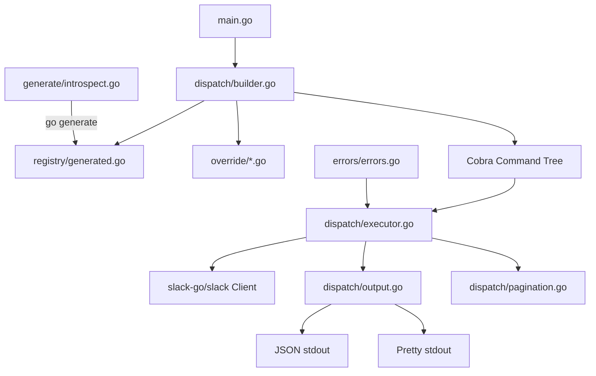

# Slack CLI Design Spec

## Overview

A Go CLI (`slack-cli`) that wraps the full Slack Web API (excluding `admin.*` methods) using the `slack-go/slack` library. Designed for dual use: AI agents (JSON-first output) and humans (`--pretty` flag). Commands are auto-generated from the `slack-go/slack` SDK via `go generate` AST introspection.

## Decisions

| Decision | Choice | Rationale |
|---|---|---|
| Language | Go | Single binary distribution, strong typing, fast execution |
| SDK | `github.com/slack-go/slack` | Most complete Go Slack library, 411+ methods |
| CLI Framework | Cobra | Industry standard for Go CLIs, tab completion, nested subcommands |
| Binary Name | `slack-cli` | Avoids conflicts with Slack desktop app |
| Auth | `SLACK_TOKEN` env var (primary), stdin pipe (secondary) | 12-factor compliant, simple for agents and CI; stdin support for secret managers |
| Output Default | JSON | Agent-first; `--pretty` flag for human-readable tables/text |
| Subcommand Style | Nested (`slack-cli chat post-message`) | Discoverable, organized, matches `gh`/`aws` conventions |
| Code Generation | `go generate` + Go AST introspection | Single toolchain, generates method registry from SDK source |
| Architecture | Thin dispatch layer + generated method table | Simple generator, generic dispatcher, override escape hatch |
| Pagination | Single page default, `--all` to auto-paginate | Safe default, explicit opt-in for full data |
| Errors | Exit 1 + JSON for API errors; exit 2-4 for CLI failures | Agents distinguish API errors from tool failures |
| Scope | All Web API methods except `admin.*` | ~350+ methods across ~28 categories |

## Architecture



### Flow

1. `main.go` initializes the root Cobra command with global flags (`--pretty`, `--all`, `--limit`, `--cursor`)
2. `dispatch/builder.go` reads the method registry and dynamically builds the Cobra command tree at startup
3. Override commands (if any) replace registry entries for specific methods
4. When a command executes, `dispatch/executor.go` maps CLI flags to SDK method parameters and calls the appropriate `slack-go/slack` method via reflection
5. `dispatch/output.go` formats the response (JSON default, or pretty-printed if `--pretty`)
6. `dispatch/pagination.go` handles `--all` by following cursors automatically

## Project Structure

```
slack-cli/
├── cmd/
│   └── slack-cli/
│       └── main.go              # Entry point, root Cobra command
├── internal/
│   ├── registry/
│   │   ├── method.go            # MethodDef struct, registry types
│   │   └── generated.go         # go:generate output - the method table
│   ├── dispatch/
│   │   ├── builder.go           # Builds Cobra tree from registry
│   │   ├── executor.go          # Calls slack-go methods via reflection
│   │   ├── output.go            # JSON default / --pretty formatting
│   │   └── pagination.go        # --all / --cursor / --limit handling
│   ├── override/
│   │   └── override.go          # Override registry + hand-crafted commands
│   ├── validate/
│   │   └── validate.go          # Input validation (IDs, paths, JSON, limits)
│   └── errors/
│       └── errors.go            # Exit code mapping
├── generate/
│   ├── introspect.go            # AST parser for slack-go/slack
│   └── templates.go             # Go templates for generated code
├── go.mod
├── go.sum
├── Makefile
└── docs/
```

## Component Details

### 1. Method Registry (`internal/registry/`)

The registry is the core data structure: a slice of `MethodDef` values that describe every Slack API method.

```go
package registry

// ParamDef describes a single parameter for a Slack API method.
type ParamDef struct {
    Name        string // CLI flag name (kebab-case, e.g., "channel-id")
    SDKName     string // Go struct field or param name (e.g., "ChannelID")
    Type        string // "string", "int", "bool", "string-slice", "json"
    Required    bool
    Description string
    Default     string // Default value if any
}

// MethodDef describes a single Slack API method exposed as a CLI command.
type MethodDef struct {
    // API identity
    APIMethod   string // Slack API method name (e.g., "chat.postMessage")
    Category    string // Subcommand group (e.g., "chat")
    Command     string // Subcommand action (e.g., "post-message")
    
    // SDK mapping
    SDKMethod   string // Go method name on *slack.Client (e.g., "PostMessageContext")
    
    // CLI metadata
    Description string
    Params      []ParamDef
    
    // Pagination
    Paginated       bool   // Whether this method supports cursor pagination
    CursorParam     string // Name of the cursor parameter
    CursorResponse  string // JSON path to next_cursor in response
    
    // Request style
    ReturnsSlice bool   // Whether the primary return is a slice (for --all aggregation)
    ResponseKey  string // JSON key containing the primary data in response
}

// Registry is the complete method table, populated by generated.go.
var Registry []MethodDef
```

### 2. Code Generator (`generate/introspect.go`)

A `go generate` tool that:

1. Locates the `slack-go/slack` package in the module cache
2. Parses all `.go` files using `go/ast` and `go/types`
3. Finds all methods on `*Client` that end with `Context`
4. For each method:
   - Extracts the method name, maps to API method name (e.g., `PostMessageContext` -> `chat.postMessage`)
   - Inspects parameter types: simple params become individual `ParamDef` entries; struct params are expanded field-by-field
   - Detects pagination by looking for `Cursor` fields in param structs and `NextCursor` in response types
   - Skips methods starting with `Admin` (per scope exclusion)
5. Emits `internal/registry/generated.go` containing the populated `Registry` slice

**Method name to API method mapping:**

The generator parses each method body to extract the API endpoint string literal passed to `postMethod`/`postJSONMethod`/`getMethod` (e.g., `"chat.postMessage"`). This is the most accurate mapping since it is what the SDK actually calls at runtime.

Fallback: For methods where the string literal is not directly extractable, the generator maintains a supplementary mapping table that can be hand-curated.

### 3. Dispatcher (`internal/dispatch/`)

#### builder.go

At startup, iterates the registry and builds the Cobra command tree:

```go
func BuildCommands(root *cobra.Command, reg []registry.MethodDef, overrides map[string]*cobra.Command) {
    groups := groupByCategory(reg)
    for category, methods := range groups {
        groupCmd := &cobra.Command{
            Use:   category,
            Short: fmt.Sprintf("Slack %s API methods", category),
        }
        for _, m := range methods {
            if override, ok := overrides[m.APIMethod]; ok {
                groupCmd.AddCommand(override)
                continue
            }
            groupCmd.AddCommand(buildMethodCommand(m))
        }
        root.AddCommand(groupCmd)
    }
}
```

#### executor.go

Executes SDK calls via reflection:

```go
func Execute(ctx context.Context, client *slack.Client, method registry.MethodDef, flags map[string]interface{}) (interface{}, error) {
    // 1. Validate all required flags are present and pass format validation
    // 2. Look up the method on *slack.Client by SDKMethod name
    // 3. Build arguments from flags using ParamDef type info
    // 4. Apply per-request timeout: wrap ctx with method.DefaultTimeout or global --timeout
    //    timeoutCtx, cancel := context.WithTimeout(ctx, timeout)
    //    defer cancel()
    // 5. Call the method with timeoutCtx (all SDK *Context methods accept context.Context)
    // 6. Extract return values, separate data from error
    // 7. Return the data for output formatting
}
```

For struct parameters, the executor creates the struct via reflection and populates fields from CLI flags. For simple parameters, it passes them positionally.

#### output.go

```go
func FormatOutput(data interface{}, pretty bool) error {
    if pretty {
        return formatPretty(data) // tabwriter or similar
    }
    encoder := json.NewEncoder(os.Stdout)
    encoder.SetIndent("", "  ")
    return encoder.Encode(data)
}
```

#### pagination.go

```go
func ExecuteWithPagination(
    ctx context.Context,
    client *slack.Client,
    method registry.MethodDef,
    flags map[string]interface{},
    fetchAll bool,
    limit int,
    maxResults int, // hard cap from --max-results (default 10000)
) (interface{}, error) {
    if !fetchAll {
        return Execute(ctx, client, method, flags)
    }
    
    // Apply hard cap: effective limit is min(limit, maxResults) when both are set,
    // or maxResults when limit is 0 (unlimited).
    effectiveLimit := maxResults
    if limit > 0 && limit < maxResults {
        effectiveLimit = limit
    }
    
    var allResults []interface{}
    cursor := ""
    for {
        // Check for cancellation (SIGINT/SIGTERM) between pages
        select {
        case <-ctx.Done():
            // Return partial results collected so far with resumption cursor
            return partialResponse(allResults, cursor, ctx.Err()), nil
        default:
        }
        
        flags[method.CursorParam] = cursor
        result, err := Execute(ctx, client, method, flags)
        if err != nil {
            // On rate limit during pagination without --wait-on-rate-limit,
            // return partial results + cursor for resumption
            if isRateLimitError(err) {
                return partialResponse(allResults, cursor, err), nil
            }
            return nil, err
        }
        items := extractSlice(result, method.ResponseKey)
        allResults = append(allResults, items...)
        cursor = extractCursor(result, method.CursorResponse)
        if cursor == "" || len(allResults) >= effectiveLimit {
            break
        }
    }
    if len(allResults) > effectiveLimit {
        allResults = allResults[:effectiveLimit]
    }
    return allResults, nil
}
```

### 4. Input Validation (`internal/validate/`)

The CLI MUST validate flag values **before** making any API call to provide fast, clear feedback and avoid wasting rate limit budget on malformed requests.

**Validation rules:**

| Validation | Rule | Rationale |
|---|---|---|
| Required params | Enforced at CLI level via Cobra `MarkFlagRequired` | Fail fast with `ExitInputError` (3) before any network call |
| Channel IDs | MUST match `^[CDG][A-Z0-9]{8,}$` regex | Catches typos, prevents sending plaintext channel names where IDs are expected |
| User IDs | MUST match `^[UWB][A-Z0-9]{8,}$` regex | Same rationale |
| Timestamp values | MUST match `^\d{10}\.\d{6}$` format | Slack message timestamps have a specific format |
| `--limit` | MUST be > 0 when specified with `--all` | Zero limit with `--all` now capped by `--max-results` default |
| `--timeout` | MUST be > 0 and <= 5m | Prevents indefinite hangs and unreasonable waits |
| `--json` typed params | MUST be valid JSON, validated with `json.Valid()` | Catches malformed JSON before API call |
| `--file` paths | MUST pass file existence check, MUST NOT be a directory, MUST resolve symlinks and verify the resolved path is within allowed scope | See File Upload Security section |

**Validation is additive**: the API will still reject invalid values that pass local validation (e.g., a well-formatted channel ID that does not exist). The goal is to catch obvious mistakes locally.

```go
package validate

// ValidateChannelID returns an error if the value does not look like a Slack channel ID.
func ValidateChannelID(value string) error {
    if !channelIDRegex.MatchString(value) {
        return fmt.Errorf("invalid channel ID %q: expected format C/D/G followed by alphanumeric (e.g., C01ABC23DEF)", value)
    }
    return nil
}
```

### 5. Error Handling (`internal/errors/`)

```go
package errors

const (
    ExitOK         = 0 // Success
    ExitAPIError   = 1 // Slack API returned an error
    ExitAuthError  = 2 // Missing or invalid SLACK_TOKEN
    ExitInputError = 3 // Invalid flags, missing required params
    ExitNetError   = 4 // Network/HTTP failure
)
```

Error classification inspects the error chain using `errors.As`:

- `slack.SlackErrorResponse` with auth-related error strings -> ExitAuthError
- `slack.SlackErrorResponse` (other) -> ExitAPIError
- `slack.RateLimitedError` -> ExitAPIError (with `retry_after` in JSON output)
- `slack.StatusCodeError` -> ExitNetError
- Other errors -> ExitNetError

Error output format (always JSON to **stderr**, never stdout):

Errors MUST be written to stderr, not stdout. Writing errors to stdout mixes error data with
successful response data, breaking pipelines like `slack-cli conversations list | jq '.channels[]'`.
Agents parsing stdout can rely on it containing only valid response JSON on success, or being empty
on failure. The exit code plus stderr JSON provides the error signal.

```json
{
    "ok": false,
    "error": "channel_not_found",
    "exit_code": 1
}
```

### 5. Global Flags

| Flag | Type | Default | Description |
|---|---|---|---|
| `--pretty` | bool | false | Human-readable output instead of JSON |
| `--all` | bool | false | Auto-paginate to fetch all results |
| `--limit` | int | 0 | Max total results when using `--all` (0 = unlimited) |
| `--cursor` | string | "" | Manual pagination cursor |
| `--timeout` | duration | 30s | Request timeout |
| `--debug` | bool | false | Print HTTP request/response details to stderr (tokens redacted) |
| `--token` | string | "" | Slack API token (WARNING: visible in process table; prefer `SLACK_TOKEN` env var or stdin pipe) |
| `--wait-on-rate-limit` | bool | false | Opt-in: sleep and retry when rate limited instead of exiting |
| `--max-results` | int | 10000 | Hard cap on total results when using `--all` to prevent unbounded memory growth |

### 6. Override System (`internal/override/`)

For commands that need richer UX than the generic dispatcher:

```go
package override

var Overrides = map[string]*cobra.Command{}

func Register(apiMethod string, cmd *cobra.Command) {
    Overrides[apiMethod] = cmd
}
```

Overrides are registered via `init()` functions. The builder checks the override map before creating a generic command for each method.

### 7. Entry Point (`cmd/slack-cli/main.go`)

```go
package main

func main() {
    root := &cobra.Command{
        Use:   "slack-cli",
        Short: "Slack Web API CLI",
        Long:  "CLI for the full Slack Web API. JSON output by default, --pretty for humans.",
    }
    
    // Global flags
    root.PersistentFlags().Bool("pretty", false, "Human-readable output")
    root.PersistentFlags().Bool("all", false, "Auto-paginate all results")
    root.PersistentFlags().Int("limit", 0, "Max results with --all")
    root.PersistentFlags().String("cursor", "", "Pagination cursor")
    root.PersistentFlags().Duration("timeout", 30*time.Second, "Request timeout")
    root.PersistentFlags().Bool("debug", false, "Debug HTTP traffic to stderr (Authorization header redacted)")
    root.PersistentFlags().String("token", "", "Slack API token (WARNING: visible in process table)")
    root.PersistentFlags().Bool("wait-on-rate-limit", false, "Sleep and retry on rate limit")
    root.PersistentFlags().Int("max-results", 10000, "Hard cap on --all pagination results")
    
    // Auth: env var (primary), stdin pipe (secondary), --token flag (warn + accept)
    token := os.Getenv("SLACK_TOKEN")
    if token == "" && !terminal.IsTerminal(int(os.Stdin.Fd())) {
        // Read token from stdin pipe (e.g., `vault read -field=token | slack-cli ...`)
        tokenBytes, _ := io.ReadAll(io.LimitReader(os.Stdin, 256))
        token = strings.TrimSpace(string(tokenBytes))
    }
    // SECURITY: If --token flag was used, emit a warning to stderr because
    // CLI flags are visible in the OS process table (ps aux) and shell history.
    if tokenFromFlag != "" {
        fmt.Fprintln(os.Stderr, "WARNING: passing tokens via --token flag exposes them in the process table and shell history. Use SLACK_TOKEN env var or stdin pipe instead.")
        token = tokenFromFlag
    }
    if token == "" {
        // Deferred: only fail when a command actually needs the client
    }
    
    // Build command tree
    dispatch.BuildCommands(root, registry.Registry, override.Overrides)
    
    if err := root.Execute(); err != nil {
        os.Exit(errors.ExitInputError)
    }
}
```

## CLI Usage Examples

```bash
# List channels (JSON, single page)
slack-cli conversations list

# List ALL channels with pretty output
slack-cli conversations list --all --pretty

# Post a message
slack-cli chat post-message --channel C123ABC --text "Hello from CLI"

# Get user info
slack-cli users info --user U123ABC

# Search messages
slack-cli search messages --query "deployment failed" --all --pretty

# Upload a file
slack-cli files upload --channels C123ABC --file ./report.pdf --title "Q4 Report"

# Get conversation history with limit
slack-cli conversations history --channel C123ABC --all --limit 100

# Debug mode
slack-cli conversations info --channel C123ABC --debug

# Manual pagination
slack-cli conversations list --limit 5 --cursor "dXNlcjpVMDYx..."
```

## Testing Strategy

1. **Generator tests**: Verify AST parsing produces correct `MethodDef` entries for known SDK methods
2. **Dispatcher tests**: Unit test `builder.go`, `executor.go`, `output.go`, `pagination.go` with mock registry entries
3. **Integration tests**: Test real SDK calls against Slack API (requires token, run in CI with secrets)
4. **Override tests**: Verify overrides replace generated commands correctly
5. **E2E tests**: Build binary, invoke commands, verify JSON output structure and exit codes

## Special Cases

### File Uploads

File upload methods (`files.upload`, `files.uploadV2`) use multipart form data. The executor detects file parameters and handles `io.Reader` construction from `--file` flag paths.

### Rate Limiting

When the SDK returns `RateLimitedError`, the CLI:

- Outputs the error as JSON to **stderr** with `retry_after` field (seconds) and a human-readable message
- Emits the `Retry-After` value prominently so callers can act on it:
  ```json
  {
      "ok": false,
      "error": "rate_limited",
      "retry_after_seconds": 30,
      "message": "Rate limited by Slack API. Retry after 30 seconds.",
      "exit_code": 1
  }
  ```
- If `--wait-on-rate-limit` is set: sleeps for the `Retry-After` duration, then retries the request (up to 3 retries max, to prevent infinite loops). Emits a progress message to stderr: `"Rate limited. Waiting 30s before retry (attempt 2/3)..."`
- If `--wait-on-rate-limit` is NOT set (default): exits with code 1 immediately. Agents handle their own retry logic.
- During `--all` pagination: if `--wait-on-rate-limit` is set, rate limits are handled transparently per-page. If not set, the CLI returns all results collected so far plus a `"partial": true` field and the cursor for resumption.

### Methods with io.Writer (Downloads)

Methods like `GetFile` that write to `io.Writer` are special-cased in the executor to write binary data to stdout or to a path specified by `--output`.

## Security and Reliability

### Token Security

The CLI MUST follow a strict token precedence order:

1. `SLACK_TOKEN` environment variable (RECOMMENDED, 12-factor compliant)
2. Stdin pipe (for secret manager integration, e.g., `vault read -field=token secret/slack | slack-cli ...`)
3. `--token` flag (ACCEPTED but triggers a stderr warning about process table visibility)

The `--token` flag exists for convenience but the CLI MUST emit a warning to stderr when it is used:
```
WARNING: passing tokens via --token flag exposes them in the process table and shell history.
Use SLACK_TOKEN env var or stdin pipe instead.
```

Stdin token reading MUST use `io.LimitReader` capped at 256 bytes to prevent memory exhaustion from
accidental piping of large files.

### Debug Output Redaction

When `--debug` is enabled, HTTP traffic is printed to stderr. The debug transport MUST redact
sensitive headers before printing:

- `Authorization: Bearer xoxb-****` (show only prefix `xoxb-` plus last 4 characters)
- `Cookie` headers: fully redacted
- Any header containing `token`, `secret`, or `key` (case-insensitive): value replaced with `[REDACTED]`

Implementation: wrap the HTTP client's transport with a `RedactingTransport` that intercepts
round-trip logging. This ensures tokens never appear in debug output, terminal scrollback,
or log captures.

```go
type RedactingTransport struct {
    Inner http.RoundTripper
}

func (t *RedactingTransport) RoundTrip(req *http.Request) (*http.Response, error) {
    redacted := cloneRequestForLogging(req)
    if auth := redacted.Header.Get("Authorization"); auth != "" {
        redacted.Header.Set("Authorization", redactBearerToken(auth))
    }
    logRequest(redacted) // print to stderr
    resp, err := t.Inner.RoundTrip(req) // use original unredacted request
    if resp != nil {
        logResponse(resp) // response bodies may contain tokens in error messages; redact those too
    }
    return resp, err
}
```

### Signal Handling (SIGINT/SIGTERM)

The CLI MUST handle OS signals gracefully, especially during `--all` pagination where multiple
API calls are in flight sequentially:

1. Register a signal handler for `SIGINT` and `SIGTERM` at startup
2. Pass a cancellable `context.Context` through the entire call chain
3. On signal receipt, cancel the context
4. The pagination loop checks `ctx.Done()` between pages and returns partial results
5. Partial results include the last cursor for resumption:
   ```json
   {
       "results": [...],
       "partial": true,
       "next_cursor": "dXNlcjpVMDYx...",
       "reason": "interrupted"
   }
   ```
6. The CLI exits with code 0 when partial results are successfully written (data was returned)

This follows 12-factor principle IX (Disposability): maximize robustness with graceful shutdown.

### File Upload Security

When the `--file` flag is used for upload methods:

1. **Path validation**: Resolve the path with `filepath.EvalSymlinks()` to follow symlinks, then verify the resolved path exists and is a regular file (not a directory, device, or socket)
2. **Symlink transparency**: After resolving, log the resolved path to stderr if it differs from the original (so the user sees what is actually being uploaded)
3. **No path traversal via API params**: The `--file` flag MUST only accept local filesystem paths. Values starting with `http://` or `https://` MUST be rejected (use `--external-url` for URL-based uploads if the API supports it)
4. **File size check**: Read the file size before uploading. If the file exceeds Slack's upload limit (currently 1GB for paid plans), fail immediately with a clear error rather than waiting for the API to reject it
5. **Permissions check**: Verify the file is readable before starting the upload

```go
func ValidateFilePath(path string) (string, error) {
    resolved, err := filepath.EvalSymlinks(path)
    if err != nil {
        return "", fmt.Errorf("cannot resolve file path %q: %w", path, err)
    }
    info, err := os.Stat(resolved)
    if err != nil {
        return "", fmt.Errorf("cannot stat file %q: %w", resolved, err)
    }
    if !info.Mode().IsRegular() {
        return "", fmt.Errorf("path %q is not a regular file", resolved)
    }
    if resolved != path {
        fmt.Fprintf(os.Stderr, "Note: %q resolved to %q via symlink\n", path, resolved)
    }
    return resolved, nil
}
```

### Timeout Strategy

The default `--timeout` of 30s applies per-request, not to the total `--all` pagination session.
This is the correct behavior: a single page fetch should not take 30s, but paginating through
hundreds of pages legitimately takes longer.

Different method categories MAY benefit from different default timeouts in the future. For now,
30s is a reasonable default for all methods. The spec intentionally avoids per-method defaults
to keep the initial implementation simple, but the timeout infrastructure SHOULD support
per-method overrides in the `MethodDef` struct for future use:

```go
type MethodDef struct {
    // ... existing fields ...
    DefaultTimeout time.Duration // 0 means use global default
}
```

The `--timeout` flag MUST be validated: values <= 0 or > 5 minutes MUST be rejected with
`ExitInputError` (3).

### Large Response Memory Safety

The `--all` flag with no limit could theoretically accumulate millions of records in memory.
Safeguards:

1. **Hard cap (`--max-results`)**: Default 10,000. Prevents unbounded memory growth. Users who genuinely need more MUST explicitly set `--max-results 0` (unlimited) or a higher value.
2. **Streaming output (future)**: For v1, results are accumulated in memory and written at the end. A future `--stream` flag SHOULD write NDJSON (newline-delimited JSON) to stdout as each page arrives, keeping memory constant regardless of result count.
3. **Progress indication**: During `--all` pagination, emit page count and running total to stderr: `"Fetching page 5... (2,500 results so far)"`

## Out of Scope

- Admin API methods (`admin.*`)
- Interactive OAuth flow (use `SLACK_TOKEN` directly)
- Socket Mode / RTM (persistent connections, not request-response)
- Events API webhooks
- Slack app manifest management
- Built-in retry logic (agents handle their own retry)
