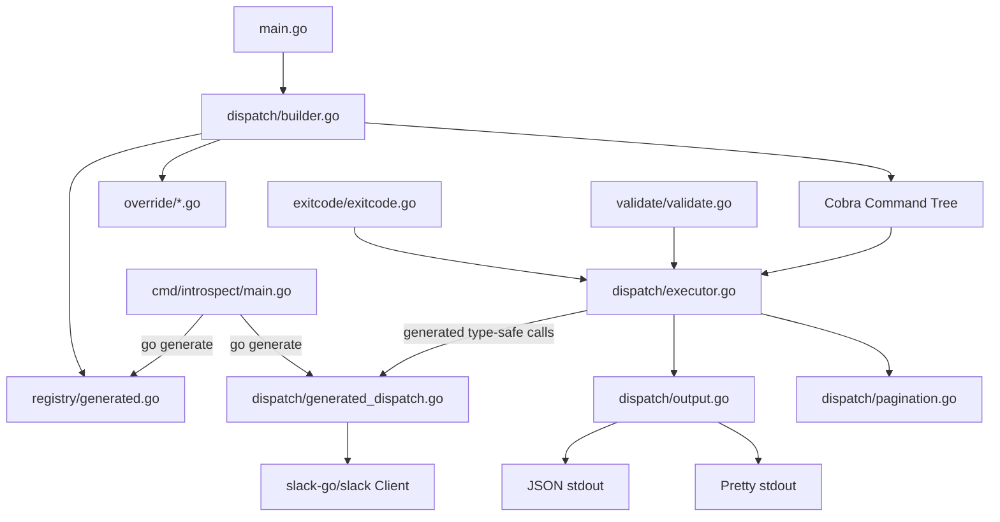

# Slack CLI Design Spec

## Overview

A Go CLI (`slack-cli`) that wraps the full Slack Web API (excluding `admin.*` methods) using the `slack-go/slack` library. Designed for dual use: AI agents (JSON-first output) and humans (`--pretty` flag). Commands and type-safe dispatch functions are auto-generated from the `slack-go/slack` SDK via `go generate` using `golang.org/x/tools/go/packages` for full type-checked introspection.

## Review Notes (2026-04-09)

> Architecture review focused on Go idioms, performance, and correctness.
> Each item is categorized as **Critical** (MUST fix before implementation),
> **Important** (SHOULD fix), or **Suggestion** (MAY improve).
> Items are addressed inline throughout the spec, marked with `[REVIEW #N]`.
>
> **Critical:**
> 1. Replace reflection-based executor with generated type-safe dispatch functions -- see [Executor](#executorgo)
> 2. Use `root.ExecuteContext(ctx)` instead of `root.Execute()` to propagate context -- see [Entry Point](#8-entry-point-cmdslack-climaingo)
> 3. `FormatOutput` MUST write to `io.Writer` param, not hardcoded `os.Stdout` -- see [output.go](#outputgo)
> 4. Rename `internal/errors` to `internal/exitcode` to avoid shadowing stdlib `errors` -- see [Error Handling](#5-error-handling-internalexitcode)
> 5. Testing MUST use stdlib `testing` + `go-cmp`, NOT testify (per project Go guidelines) -- see [Testing Strategy](#testing-strategy)
>
> **Important:**
> 6. Generator MUST use `golang.org/x/tools/go/packages` for full type resolution, not raw `go/ast` alone -- see [Code Generator](#2-code-generator-cmdintrospect)
> 7. Stream paginated results via `json.Encoder` per-page instead of accumulating in memory -- see [pagination.go](#paginationgo)
> 8. Move `generate/` to `cmd/introspect/` so it is a proper `go generate` tool binary -- see [Project Structure](#project-structure)
> 9. `SDKMethod` field is unused for dispatch if we generate type-safe functions; retain only as documentation metadata -- see [Method Registry](#1-method-registry-internalregistry)
> 10. Option builder maps (`chatOptionBuilders`) SHOULD also be generated, not hand-maintained -- see [MsgOption Handling](#msgoption-handling-strategy)
>
> **Suggestion:**
> 11. Consider `golang.org/x/sync/errgroup` for future concurrent operations (batch commands, parallel uploads)
> 12. Add `context.DeadlineExceeded` / `context.Canceled` to error classification -- see [Error Handling](#5-error-handling-internalexitcode)

## Decisions

| Decision | Choice | Rationale |
|---|---|---|
| Language | Go | Single binary distribution, strong typing, fast execution |
| SDK | `github.com/slack-go/slack` v0.21.1 | Most complete Go Slack library; 166 `*Context` methods on `*Client` |
| CLI Framework | Cobra | Industry standard for Go CLIs, built-in completion for bash/zsh/fish/powershell, nested subcommands |
| Binary Name | `slack-cli` | Avoids conflicts with Slack desktop app and Slack's own `slack` CLI tool |
| Module Path | `github.com/poconnor/slack-cli` | Standard Go module path for GitHub-hosted projects |
| Auth | `SLACK_TOKEN` env var (primary), stdin pipe (secondary) | 12-factor compliant, simple for agents and CI; stdin support for secret managers |
| Output Default | JSON | Agent-first; `--pretty` flag for human-readable tables/text |
| Subcommand Style | Nested (`slack-cli chat post-message`) | Discoverable, organized, matches `gh`/`aws` conventions |
| Command Naming | Derived from Slack API method name, not Go method name | `chat.postMessage` -> `chat post-message`; the API name is stable, canonical, and documented (see Command Naming Strategy) |
| Flag Naming | Slack API param names converted to kebab-case | `channel_id` -> `--channel-id`; reduces cognitive mapping for users referencing Slack API docs |
| Code Generation | `go generate` + `golang.org/x/tools/go/packages` | `[REVIEW #6]` Full type resolution; generates both method registry and type-safe dispatch functions |
| Architecture | Generated type-safe dispatch + method registry | `[REVIEW #1]` No runtime reflection; compile-time safety; override escape hatch |
| Pagination | Single page default, `--all` to auto-paginate with streaming | `[REVIEW #7]` Safe default, explicit opt-in, memory-bounded via per-page streaming |
| Errors | Exit 1 + JSON **to stderr** for API errors; exit 2-4 for CLI failures | Agents distinguish API errors from tool failures; stdout reserved for data only |
| Scope | All Web API methods except `admin.*` | ~166 `*Context` methods across ~28 categories (after excluding admin, RTM, socket mode) |
| Version Info | Embedded via `ldflags` at build time | `slack-cli version` prints version, git commit SHA, build date |
| Shell Completion | Cobra built-in `completion` subcommand | `slack-cli completion bash/zsh/fish/powershell` for tab completion of all commands and flags |

## Command Naming Strategy

Commands are derived from the **Slack API method name** (the string literal extracted from the SDK source), not from the Go method name. This is a deliberate choice: the API method name is the canonical, stable identifier that appears in Slack's documentation, error messages, and rate limit headers.

**Conversion rules:**

1. Split the API method name on `.` to get category and action: `chat.postMessage` -> category `chat`, action `postMessage`
2. Convert the action from camelCase to kebab-case: `postMessage` -> `post-message`
3. The resulting CLI command is `slack-cli <category> <action>`: `slack-cli chat post-message`

**Ergonomic aliases for high-frequency commands:**

Some commands benefit from shorter aliases that feel natural in a shell. These are registered as Cobra command aliases, not separate commands:

| Full command | Alias | Rationale |
|---|---|---|
| `slack-cli chat post-message` | `slack-cli chat send` | "send a message" is the natural phrasing |
| `slack-cli conversations list` | `slack-cli channels list` | "channels" is more intuitive than "conversations" |
| `slack-cli conversations history` | `slack-cli channels history` | Same rationale |
| `slack-cli reactions add` | `slack-cli react` | Common shorthand |

Aliases appear in help text as `Aliases: send, post-message` so users discover both forms.

**Flag naming convention:**

Flags match the Slack API parameter names converted to kebab-case. This means a user reading the Slack API docs for `chat.postMessage` sees parameter `channel` and uses `--channel`, sees `thread_ts` and uses `--thread-ts`. The flag-to-API-param mapping is 1:1 and predictable.

Exception: where the API uses ambiguous single-word params (e.g., `channel` could be a name or ID), the CLI flag SHOULD use the more specific form (`--channel` for ID, with validation that rejects plain channel names).

## MsgOption Handling Strategy

Several SDK methods (all chat methods, some canvas methods) use the `...MsgOption` functional options pattern instead of struct parameters. The generated dispatch functions MUST construct `MsgOption` values from CLI flags.

`[REVIEW #10]` The option builder maps SHOULD be generated by the introspect tool rather than hand-maintained. The generator can identify `MsgOption` constructor functions in the SDK by finding all exported functions that return `MsgOption`. Each constructor's parameter list defines the CLI flags it needs.

**SDK methods affected:** `PostMessageContext`, `UpdateMessageContext`, `PostEphemeralContext`, `ScheduleMessageContext`, `SendMessageContext`, `StartStreamContext`, `AppendStreamContext`, `StopStreamContext`, plus canvas and usergroup methods with their own option types.

**Approach: Option Builder Map**

The executor maintains a mapping from flag names to `MsgOption` constructor functions:

```go
// optionBuilders maps CLI flag names to MsgOption constructors for chat methods.
var chatOptionBuilders = map[string]func(value string) slack.MsgOption{
    "text":             func(v string) slack.MsgOption { return slack.MsgOptionText(v, true) },
    "thread-ts":        func(v string) slack.MsgOption { return slack.MsgOptionTS(v) },
    "reply-broadcast":  func(_ string) slack.MsgOption { return slack.MsgOptionBroadcast() },
    "unfurl-links":     func(_ string) slack.MsgOption { return slack.MsgOptionEnableLinkUnfurl() },
    "icon-url":         func(v string) slack.MsgOption { return slack.MsgOptionIconURL(v) },
    "icon-emoji":       func(v string) slack.MsgOption { return slack.MsgOptionIconEmoji(v) },
    "blocks":           func(v string) slack.MsgOption { return parseMsgOptionBlocks(v) },
    "metadata":         func(v string) slack.MsgOption { return parseMsgOptionMetadata(v) },
    // ... remaining MsgOption mappings
}
```

For chat methods, the `MethodDef` includes a `CallStyle` field that tells the executor to use the option builder map instead of positional/struct reflection:

```go
type MethodDef struct {
    // ... existing fields ...
    CallStyle string // "positional", "struct", "msgoption", "custom-option"
}
```

The generator detects `...MsgOption` in the method signature and sets `CallStyle: "msgoption"`. The executor then:

1. Extracts the `channelID` (first positional param after context) from flags
2. Iterates remaining flags, looking up each in `chatOptionBuilders`
3. Collects the resulting `[]MsgOption` slice
4. Calls the method: `client.PostMessageContext(ctx, channelID, options...)`

This approach handles the 45+ `MsgOption` functions without requiring each chat command to be a full override. Methods with custom option types (`GetConversationsOption`, `CreateUserGroupOption`, etc.) use analogous builder maps keyed by option type name.

**When to use overrides instead:** If a method's option pattern is too unusual for the builder map (e.g., `UnfurlMessageContext` which takes both positional `map[string]Attachment` AND `...MsgOption`), it SHOULD be implemented as an override command.

## Architecture



### Flow

1. `main.go` creates a cancellable `context.Context` via `signal.NotifyContext` for `SIGINT`/`SIGTERM`, then initializes the root Cobra command with global flags and calls `root.ExecuteContext(ctx)` `[REVIEW #2]`
2. `dispatch/builder.go` reads the method registry and dynamically builds the Cobra command tree at startup
3. Override commands (if any) replace registry entries for specific methods
4. When a command executes, `dispatch/executor.go` looks up the generated type-safe dispatch function by API method name and calls it (no reflection) `[REVIEW #1]`
5. `dispatch/output.go` formats the response to an `io.Writer` parameter (JSON default, or pretty-printed if `--pretty`) `[REVIEW #3]`
6. `dispatch/pagination.go` handles `--all` by following cursors, streaming each page via `json.Encoder` `[REVIEW #7]`

## Project Structure

```
slack-cli/
├── cmd/
│   ├── slack-cli/
│   │   └── main.go                  # Entry point, root Cobra command, signal handling
│   └── introspect/
│       ├── main.go                  # [REVIEW #8] go generate tool binary
│       ├── templates.go             # Go templates for generated code
│       └── descriptions.yaml        # Hand-maintained method descriptions for help text
├── internal/
│   ├── registry/
│   │   ├── method.go                # MethodDef struct, registry types
│   │   └── generated.go             # go:generate output - the method table
│   ├── dispatch/
│   │   ├── builder.go               # Builds Cobra tree from registry
│   │   ├── executor.go              # [REVIEW #1] Delegates to generated dispatch; no reflection
│   │   ├── generated_dispatch.go    # [REVIEW #1] go:generate output - type-safe SDK call functions
│   │   ├── output.go                # [REVIEW #3] JSON/pretty formatting; writes to io.Writer param
│   │   └── pagination.go            # [REVIEW #7] --all with streaming output
│   ├── override/
│   │   └── override.go              # Override registry + hand-crafted commands
│   ├── validate/
│   │   └── validate.go              # Input validation (IDs, paths, JSON, limits)
│   └── exitcode/
│       └── exitcode.go              # [REVIEW #4] Exit code constants and error classifier
├── go.mod                           # module github.com/poconnor/slack-cli
├── go.sum
├── Makefile                         # See Makefile Targets section
├── CLAUDE.md                        # AI agent developer instructions
├── README.md                        # See README section
└── docs/
```

**`[REVIEW #8]` Why `cmd/introspect/` instead of `generate/`:** The code generator is a standalone Go binary invoked by `go generate`. Placing it under `cmd/` follows the standard Go project layout convention where each subdirectory of `cmd/` is a separate binary. With `cmd/introspect/`, the `go:generate` directive becomes:

```go
//go:generate go run ./cmd/introspect
```

**`[REVIEW #4]` Why `internal/exitcode/` instead of `internal/errors/`:** A package named `errors` shadows the stdlib `errors` package. Every file that imports both would require aliasing (`stderrors "errors"`), which violates the Go guideline that import renaming SHOULD NOT be needed unless avoiding collision. The name `exitcode` also more accurately describes the package's purpose: mapping error conditions to process exit codes.

### Makefile Targets

```makefile
MODULE   := github.com/poconnor/slack-cli
VERSION  := $(shell git describe --tags --always --dirty 2>/dev/null || echo "dev")
COMMIT   := $(shell git rev-parse --short HEAD 2>/dev/null || echo "unknown")
DATE     := $(shell date -u +%Y-%m-%dT%H:%M:%SZ)
LDFLAGS  := -ldflags "-X main.version=$(VERSION) -X main.commit=$(COMMIT) -X main.date=$(DATE)"

.PHONY: generate build test lint install clean

generate:          ## Run go generate to rebuild registry and dispatch from SDK source
	go generate ./cmd/introspect/...

build: generate    ## Build the slack-cli binary
	go build $(LDFLAGS) -o bin/slack-cli ./cmd/slack-cli

test:              ## Run all tests
	go test -race -count=1 ./...

lint:              ## Run golangci-lint
	golangci-lint run ./...

install: build     ## Install slack-cli to $GOPATH/bin
	go install $(LDFLAGS) ./cmd/slack-cli

clean:             ## Remove build artifacts and generated files
	rm -rf bin/
	rm -f internal/registry/generated.go
```

### Version Embedding

Build version, commit SHA, and date are injected via `ldflags` at build time and exposed through a `slack-cli version` subcommand:

```go
// cmd/slack-cli/main.go
var (
    version = "dev"
    commit  = "unknown"
    date    = "unknown"
)

// version subcommand
versionCmd := &cobra.Command{
    Use:   "version",
    Short: "Print version information",
    Run: func(cmd *cobra.Command, args []string) {
        fmt.Printf("slack-cli %s (commit %s, built %s)\n", version, commit, date)
    },
}
```

### Shell Completion

Cobra provides a built-in `completion` subcommand. The spec relies on this default behavior, which generates completion scripts for bash, zsh, fish, and powershell:

```bash
# Add to ~/.bashrc or ~/.zshrc
eval "$(slack-cli completion bash)"
eval "$(slack-cli completion zsh)"

# Or generate a file
slack-cli completion bash > /etc/bash_completion.d/slack-cli
```

Shell completion covers all generated subcommands (categories and actions), all global flags, and all per-command flags. This works automatically because commands are built using Cobra's `AddCommand` API at startup.

### README Contents

The project README MUST cover:

1. **One-line description**: What the tool does and who it is for (agents and humans)
2. **Installation**: `go install`, binary download, Homebrew (if published)
3. **Quick start**: Set `SLACK_TOKEN`, run a basic command, see output
4. **Authentication**: `SLACK_TOKEN` env var, stdin pipe, `--token` flag (with security warning)
5. **Command structure**: How commands map to Slack API methods (`slack-cli <category> <action>`)
6. **Common examples**: The most-used 5-6 commands with realistic flag values
7. **Shell completion**: How to enable tab completion
8. **Global flags reference**: Table of all global flags with descriptions
9. **Output formats**: JSON (default) vs `--pretty`, piping to `jq`
10. **Pagination**: `--all`, `--limit`, `--cursor`, `--max-results` explained
11. **Error handling**: Exit codes and what they mean for automation
12. **Building from source**: `make build`, `make generate`, `make test`
13. **Contributing**: How to add override commands, how generation works

### CLAUDE.md

The project SHOULD include a `CLAUDE.md` at the repo root for AI agent developers. Contents:

```markdown
# CLAUDE.md - slack-cli

## What this project is
Go CLI wrapping the Slack Web API. Agent-first (JSON output), human-friendly (--pretty).

## Build and test
make generate  # Rebuild registry from slack-go/slack SDK
make build     # Build binary to bin/slack-cli
make test      # Run all tests with race detector
make lint      # Run golangci-lint

## Architecture
- `cmd/introspect/` - Type-checked introspection of slack-go/slack, emits registry + dispatch
- `internal/registry/` - MethodDef structs, generated.go is the method table
- `internal/dispatch/` - Cobra command builder, generated type-safe dispatch (no reflection), output formatting
- `internal/override/` - Hand-crafted commands replacing generated ones
- `internal/exitcode/` - Exit code constants and error classifier
- `cmd/slack-cli/` - Entry point with signal handling

## Key patterns
- Generated dispatch: type-safe SDK calls, no runtime reflection
- Methods using `...MsgOption` use generated option builder maps
- Override system replaces generated commands for methods needing custom UX
- Errors go to stderr (JSON), data goes to stdout
- All SDK calls use *Context methods with cancellable context
- Testing: stdlib testing + go-cmp, httptest.Server for mocking, table-driven tests

## Testing
- Generator tests: verify type-checked introspection against known SDK methods
- Dispatcher tests: httptest.Server mocks, test flag-to-param mapping
- E2E tests: build binary, invoke commands, check JSON output + exit codes
```

## Component Details

### 1. Method Registry (`internal/registry/`)

The registry is the core data structure: a slice of `MethodDef` values that describe every Slack API method.

```go
package registry

// ParamDef describes a single parameter for a Slack API method.
type ParamDef struct {
    Name        string // CLI flag name (kebab-case, e.g., "channel-id")
    SDKName     string // Go struct field or param name (e.g., "ChannelID")
    Type        string // "string", "int", "bool", "string-slice", "json"
    Required    bool
    Description string
    Default     string // Default value if any
}

// MethodDef describes a single Slack API method exposed as a CLI command.
type MethodDef struct {
    // API identity
    APIMethod   string // Slack API method name (e.g., "chat.postMessage")
    Category    string // Subcommand group (e.g., "chat")
    Command     string // Subcommand action (e.g., "post-message")
    
    // SDK mapping (documentation only; dispatch uses generated functions, not reflection)
    // [REVIEW #9] This field is no longer used for runtime dispatch. Retained as
    // documentation metadata so the registry is self-describing.
    SDKMethod   string // Go method name on *slack.Client (e.g., "PostMessageContext")
    
    // CLI metadata
    Description string
    DocsURL     string // Slack API docs URL (e.g., "https://api.slack.com/methods/chat.postMessage")
    Aliases     []string // Ergonomic command aliases (e.g., ["send"] for post-message)
    Params      []ParamDef
    
    // Pagination
    Paginated       bool   // Whether this method supports cursor pagination
    CursorParam     string // Name of the cursor parameter
    CursorResponse  string // JSON path to next_cursor in response
    
    // Request style
    CallStyle    string // "positional", "struct", "msgoption", "custom-option" (see MsgOption Handling Strategy)
    ReturnsSlice bool   // Whether the primary return is a slice (for --all aggregation)
    ResponseKey  string // JSON key containing the primary data in response
}

// Registry is the complete method table, populated by generated.go.
var Registry []MethodDef
```

### 2. Code Generator (`cmd/introspect/`)

`[REVIEW #6]` A `go generate` tool binary that uses `golang.org/x/tools/go/packages` for full type-checked introspection.

**Why `golang.org/x/tools/go/packages` instead of raw `go/ast`:** Raw `go/ast` parsing cannot resolve types across packages. When the SDK defines a method like `PostMessageContext(ctx context.Context, channelID string, options ...MsgOption)`, raw AST sees `MsgOption` as an unresolved identifier. The `go/packages` loader runs the full type checker, resolving all types, following type aliases, and expanding embedded structs. This is essential for:

- Correctly identifying parameter types defined in other packages or files
- Resolving type aliases (e.g., `type ChannelID = string`)
- Expanding embedded struct fields in parameter structs
- Distinguishing `context.Context` parameters from other interface types
- Detecting which return values implement `error`
- Identifying `MsgOption` and similar functional option types for `CallStyle` detection

The tool:

1. Loads the `slack-go/slack` package using `packages.Load` with `packages.NeedTypes | packages.NeedSyntax | packages.NeedTypesInfo`
2. Iterates the type-checked method set of `*slack.Client`
3. Finds all methods ending with `Context` (the context-aware variants)
4. For each method:
   - Extracts the method name, maps to API method name (e.g., `PostMessageContext` -> `chat.postMessage`)
   - Inspects parameter types using `types.Func` signatures: simple params become individual `ParamDef` entries; struct params are expanded field-by-field
   - Detects `...MsgOption` and similar functional option patterns to set `CallStyle`
   - Detects pagination by looking for `Cursor` fields in param structs and `NextCursor` in response types
   - Skips methods whose extracted API endpoint starts with `admin.` (per scope exclusion)
   - Also skips `ConnectRTM`, `StartRTM`, `StartSocketMode` (persistent connection methods, not request-response)
5. Emits two files:
   - `internal/registry/generated.go` containing the populated `Registry` slice
   - `internal/dispatch/generated_dispatch.go` containing type-safe dispatch functions and option builder maps `[REVIEW #1, #10]`

**`[REVIEW #6]` Known pitfalls of `go/packages`:**
- **Build tags:** The SDK may use build tags for platform-specific code. The loader MUST be configured with the correct `GOOS`/`GOARCH`.
- **Vendor directories:** If the project uses vendoring, the load config MUST set `Dir` to the project root.
- **Module cache freshness:** The generator SHOULD verify the loaded SDK version matches `go.mod` to prevent stale generation.
- **Performance:** `go/packages` is slower than raw AST (~2-5s vs ~200ms). Acceptable for a `go generate` tool that runs infrequently.

**Important: legacy admin methods in `admin.go`**

The SDK file `admin.go` contains methods like `DisableUser`, `InviteGuest`, `SetRegular`, `SetRestricted` that are NOT `admin.*` API methods. They are legacy undocumented Slack admin endpoints. The generator's skip logic MUST be based on the extracted API endpoint string (starts with `"admin."`), not the Go source file name or method name prefix. These legacy methods SHOULD be included in the CLI if they have extractable API endpoints, or added to the supplementary mapping table if not.

**Method name to API method mapping:**

The generator parses each method body to extract the API endpoint string literal passed to `postMethod`/`postJSONMethod`/`getMethod` (e.g., `"chat.postMessage"`). This is the most accurate mapping since it is what the SDK actually calls at runtime.

Fallback: For methods where the string literal is not directly extractable, the generator maintains a supplementary mapping table that can be hand-curated.

### 3. Dispatcher (`internal/dispatch/`)

#### builder.go

At startup, iterates the registry and builds the Cobra command tree:

```go
func BuildCommands(root *cobra.Command, reg []registry.MethodDef, overrides map[string]*cobra.Command) {
    groups := groupByCategory(reg)
    for category, methods := range groups {
        groupCmd := &cobra.Command{
            Use:   category,
            Short: fmt.Sprintf("Slack %s API methods", category),
        }
        for _, m := range methods {
            if override, ok := overrides[m.APIMethod]; ok {
                groupCmd.AddCommand(override)
                continue
            }
            groupCmd.AddCommand(buildMethodCommand(m))
        }
        root.AddCommand(groupCmd)
    }
}
```

#### executor.go

`[REVIEW #1]` Executes SDK calls via generated type-safe dispatch functions (no reflection).

**Why not reflection:** Runtime reflection (`reflect.Value.Call`) in Go has several problems for this use case:

1. **No compile-time safety.** If the SDK changes a method signature, reflection code compiles fine and panics at runtime. Generated dispatch functions fail at compile time.
2. **Performance.** `reflect.Value.Call` allocates `[]reflect.Value` on every call. For a single-call CLI the absolute cost is negligible, but the philosophical issue is stronger: Go's type system exists to catch errors at compile time, and reflection deliberately bypasses it.
3. **Complexity.** Reflection code for struct population is fragile: field ordering, unexported fields, pointer receivers, variadic arguments, and `MsgOption` functional option patterns all require special handling. Generated code handles each method's specific signature directly.
4. **Debuggability.** Stack traces through reflected calls show `reflect.Value.Call` instead of the actual method name.

The generated dispatch file contains a function per SDK method and a lookup map:

```go
// generated_dispatch.go (auto-generated, do not edit)
package dispatch

// DispatchFunc is the signature for all generated dispatch functions.
type DispatchFunc func(ctx context.Context, client *slack.Client, flags map[string]any) (any, error)

// Dispatch maps API method names to their type-safe dispatch functions.
var Dispatch = map[string]DispatchFunc{
    "chat.postMessage":   dispatchChatPostMessage,
    "conversations.list": dispatchConversationsList,
    // ... ~166 entries
}

func dispatchChatPostMessage(ctx context.Context, client *slack.Client, flags map[string]any) (any, error) {
    channelID, _ := flags["channel"].(string)
    var opts []slack.MsgOption
    if text, ok := flags["text"].(string); ok {
        opts = append(opts, slack.MsgOptionText(text, false))
    }
    if threadTS, ok := flags["thread-ts"].(string); ok {
        opts = append(opts, slack.MsgOptionTS(threadTS))
    }
    _, timestamp, err := client.PostMessageContext(ctx, channelID, opts...)
    if err != nil {
        return nil, err
    }
    return map[string]string{"channel": channelID, "ts": timestamp}, nil
}

func dispatchConversationsList(ctx context.Context, client *slack.Client, flags map[string]any) (any, error) {
    params := &slack.GetConversationsParameters{}
    if cursor, ok := flags["cursor"].(string); ok {
        params.Cursor = cursor
    }
    if limit, ok := flags["limit"].(int); ok {
        params.Limit = limit
    }
    channels, nextCursor, err := client.GetConversationsContext(ctx, params)
    if err != nil {
        return nil, err
    }
    return map[string]any{
        "channels":    channels,
        "next_cursor": nextCursor,
    }, nil
}
```

The executor becomes a thin lookup:

```go
// executor.go
func Execute(ctx context.Context, client *slack.Client, apiMethod string, flags map[string]any) (any, error) {
    fn, ok := Dispatch[apiMethod]
    if !ok {
        return nil, fmt.Errorf("unknown API method: %s", apiMethod)
    }
    return fn(ctx, client, flags)
}
```

The `CallStyle` field in `MethodDef` is used by the **generator** (not the executor) to determine what shape of dispatch function to emit. See the MsgOption Handling Strategy section for details on the `"msgoption"` call style.

#### output.go

`[REVIEW #3]` Output functions MUST accept an `io.Writer` parameter instead of writing directly to `os.Stdout`. This enables testing without capturing stdout and supports output redirection.

```go
func FormatOutput(w io.Writer, data any, pretty bool) error {
    if pretty {
        return formatPretty(w, data) // tabwriter or similar
    }
    encoder := json.NewEncoder(w)
    encoder.SetIndent("", "  ")
    return encoder.Encode(data)
}
```

#### pagination.go

```go
func ExecuteWithPagination(
    ctx context.Context,
    client *slack.Client,
    method registry.MethodDef,
    flags map[string]interface{},
    fetchAll bool,
    limit int,
    maxResults int, // hard cap from --max-results (default 10000)
) (interface{}, error) {
    if !fetchAll {
        return Execute(ctx, client, method, flags)
    }
    
    // Apply hard cap: effective limit is min(limit, maxResults) when both are set,
    // or maxResults when limit is 0 (unlimited).
    effectiveLimit := maxResults
    if limit > 0 && limit < maxResults {
        effectiveLimit = limit
    }
    
    var allResults []interface{}
    cursor := ""
    for {
        // Check for cancellation (SIGINT/SIGTERM) between pages
        select {
        case <-ctx.Done():
            // Return partial results collected so far with resumption cursor
            return partialResponse(allResults, cursor, ctx.Err()), nil
        default:
        }
        
        flags[method.CursorParam] = cursor
        result, err := Execute(ctx, client, method, flags)
        if err != nil {
            // On rate limit during pagination without --wait-on-rate-limit,
            // return partial results + cursor for resumption
            if isRateLimitError(err) {
                return partialResponse(allResults, cursor, err), nil
            }
            return nil, err
        }
        items := extractSlice(result, method.ResponseKey)
        allResults = append(allResults, items...)
        cursor = extractCursor(result, method.CursorResponse)
        if cursor == "" || len(allResults) >= effectiveLimit {
            break
        }
    }
    if len(allResults) > effectiveLimit {
        allResults = allResults[:effectiveLimit]
    }
    return allResults, nil
}
```

### 4. Input Validation (`internal/validate/`)

The CLI MUST validate flag values **before** making any API call to provide fast, clear feedback and avoid wasting rate limit budget on malformed requests.

**Validation rules:**

| Validation | Rule | Rationale |
|---|---|---|
| Required params | Enforced at CLI level via Cobra `MarkFlagRequired` | Fail fast with `ExitInputError` (3) before any network call |
| Channel IDs | MUST match `^[CDG][A-Z0-9]{8,}$` regex | Catches typos, prevents sending plaintext channel names where IDs are expected |
| User IDs | MUST match `^[UWB][A-Z0-9]{8,}$` regex | Same rationale |
| Timestamp values | MUST match `^\d{10}\.\d{6}$` format | Slack message timestamps have a specific format |
| `--limit` | MUST be > 0 when specified with `--all` | Zero limit with `--all` now capped by `--max-results` default |
| `--timeout` | MUST be > 0 and <= 5m | Prevents indefinite hangs and unreasonable waits |
| `--json` typed params | MUST be valid JSON, validated with `json.Valid()` | Catches malformed JSON before API call |
| `--file` paths | MUST pass file existence check, MUST NOT be a directory, MUST resolve symlinks and verify the resolved path is within allowed scope | See File Upload Security section |

**Validation is additive**: the API will still reject invalid values that pass local validation (e.g., a well-formatted channel ID that does not exist). The goal is to catch obvious mistakes locally.

```go
package validate

// ValidateChannelID returns an error if the value does not look like a Slack channel ID.
func ValidateChannelID(value string) error {
    if !channelIDRegex.MatchString(value) {
        return fmt.Errorf("invalid channel ID %q: expected format C/D/G followed by alphanumeric (e.g., C01ABC23DEF)", value)
    }
    return nil
}
```

### 5. Error Handling (`internal/errors/`)

> **Note:** Section numbering corrected from duplicate "5" in earlier draft.

```go
package errors

const (
    ExitOK         = 0 // Success
    ExitAPIError   = 1 // Slack API returned an error
    ExitAuthError  = 2 // Missing or invalid SLACK_TOKEN
    ExitInputError = 3 // Invalid flags, missing required params
    ExitNetError   = 4 // Network/HTTP failure
)
```

Error classification inspects the error chain using `errors.As`:

- `slack.SlackErrorResponse` with auth-related error strings -> ExitAuthError
- `slack.SlackErrorResponse` (other) -> ExitAPIError
- `slack.RateLimitedError` -> ExitAPIError (with `retry_after` in JSON output)
- `slack.StatusCodeError` -> ExitNetError
- Other errors -> ExitNetError

Error output format (always JSON to **stderr**, never stdout):

Errors MUST be written to stderr, not stdout. Writing errors to stdout mixes error data with
successful response data, breaking pipelines like `slack-cli conversations list | jq '.channels[]'`.
Agents parsing stdout can rely on it containing only valid response JSON on success, or being empty
on failure. The exit code plus stderr JSON provides the error signal.

```json
{
    "ok": false,
    "error": "channel_not_found",
    "exit_code": 1
}
```

### 6. Global Flags

| Flag | Type | Default | Description |
|---|---|---|---|
| `--pretty` | bool | false | Human-readable output instead of JSON |
| `--output` / `-o` | string | `json` | Output format: `json` (default), `table`, `yaml` (future extensibility) |
| `--all` | bool | false | Auto-paginate to fetch all results |
| `--limit` | int | 0 | Max total results when using `--all` (0 = unlimited) |
| `--cursor` | string | "" | Manual pagination cursor |
| `--timeout` | duration | 30s | Request timeout |
| `--debug` | bool | false | Print HTTP request/response details to stderr (tokens redacted) |
| `--token` | string | "" | Slack API token (WARNING: visible in process table; prefer `SLACK_TOKEN` env var or stdin pipe) |
| `--wait-on-rate-limit` | bool | false | Opt-in: sleep and retry when rate limited instead of exiting |
| `--max-results` | int | 10000 | Hard cap on total results when using `--all` to prevent unbounded memory growth |

> **Note on `--pretty` vs `--output`:** `--pretty` is a shorthand for `--output table`. Both are
> supported for ergonomics. If both are specified, `--output` takes precedence.

### 7. Override System (`internal/override/`)

For commands that need richer UX than the generic dispatcher:

```go
package override

var Overrides = map[string]*cobra.Command{}

func Register(apiMethod string, cmd *cobra.Command) {
    Overrides[apiMethod] = cmd
}
```

Overrides are registered via `init()` functions. The builder checks the override map before creating a generic command for each method.

**Built-in override commands (not generated from SDK):**

- `api list` -- Lists all available API methods from the registry (see Discoverability section)
- `version` -- Prints version, commit, and build date
- `completion` -- Cobra's built-in shell completion generator

### 8. Entry Point (`cmd/slack-cli/main.go`)

> **Note:** Original spec had duplicate section 7 numbers. Fixed to sequential 7/8.

```go
package main

func main() {
    // Signal handling: cancellable context for graceful shutdown (12-factor IX: Disposability)
    ctx, cancel := signal.NotifyContext(context.Background(), os.Interrupt, syscall.SIGTERM)
    defer cancel()
    
    root := &cobra.Command{
        Use:   "slack-cli",
        Short: "Slack Web API CLI",
        Long:  "CLI for the full Slack Web API. JSON output by default, --pretty for humans.",
    }
    
    // Global flags
    root.PersistentFlags().Bool("pretty", false, "Human-readable output")
    root.PersistentFlags().Bool("all", false, "Auto-paginate all results")
    root.PersistentFlags().Int("limit", 0, "Max results with --all")
    root.PersistentFlags().String("cursor", "", "Pagination cursor")
    root.PersistentFlags().Duration("timeout", 30*time.Second, "Request timeout")
    root.PersistentFlags().Bool("debug", false, "Debug HTTP traffic to stderr (Authorization header redacted)")
    root.PersistentFlags().String("token", "", "Slack API token (WARNING: visible in process table)")
    root.PersistentFlags().Bool("wait-on-rate-limit", false, "Sleep and retry on rate limit")
    root.PersistentFlags().Int("max-results", 10000, "Hard cap on --all pagination results")
    
    // Auth: env var (primary), stdin pipe (secondary), --token flag (warn + accept)
    token := os.Getenv("SLACK_TOKEN")
    if token == "" && !terminal.IsTerminal(int(os.Stdin.Fd())) {
        // Read token from stdin pipe (e.g., `vault read -field=token | slack-cli ...`)
        tokenBytes, _ := io.ReadAll(io.LimitReader(os.Stdin, 256))
        token = strings.TrimSpace(string(tokenBytes))
    }
    // SECURITY: If --token flag was used, emit a warning to stderr because
    // CLI flags are visible in the OS process table (ps aux) and shell history.
    if tokenFromFlag != "" {
        fmt.Fprintln(os.Stderr, "WARNING: passing tokens via --token flag exposes them in the process table and shell history. Use SLACK_TOKEN env var or stdin pipe instead.")
        token = tokenFromFlag
    }
    if token == "" {
        // Deferred: only fail when a command actually needs the client
    }
    
    // Build command tree
    dispatch.BuildCommands(root, registry.Registry, override.Overrides)
    
    if err := root.Execute(); err != nil {
        os.Exit(errors.ExitInputError)
    }
}
```

## CLI Usage Examples

```bash
# List channels (JSON, single page)
slack-cli conversations list

# List ALL channels with pretty output
slack-cli conversations list --all --pretty

# Post a message (full form)
slack-cli chat post-message --channel C123ABC --text "Hello from CLI"

# Post a message (ergonomic alias)
slack-cli chat send --channel C123ABC --text "Hello from CLI"

# Get user info
slack-cli users info --user U123ABC

# Search messages
slack-cli search messages --query "deployment failed" --all --pretty

# Upload a file
slack-cli files upload --channels C123ABC --file ./report.pdf --title "Q4 Report"

# Get conversation history with limit
slack-cli conversations history --channel C123ABC --all --limit 100

# Debug mode
slack-cli conversations info --channel C123ABC --debug

# Manual pagination
slack-cli conversations list --limit 5 --cursor "dXNlcjpVMDYx..."

# Shell completion setup
eval "$(slack-cli completion zsh)"

# Version info
slack-cli version

# Discover available API categories
slack-cli --help

# Discover commands within a category
slack-cli chat --help

# List all available API methods
slack-cli api list
slack-cli api list --category chat
```

## Help Text Quality

The `slack-go/slack` SDK has minimal documentation on most methods -- typically just "For more details, see XContext documentation" or a reference to the Slack API docs URL. The generator MUST produce useful help text despite this.

**Help text sourcing strategy (in priority order):**

1. **Slack API doc URL**: Every `MethodDef` MUST include the Slack API docs URL (e.g., `https://api.slack.com/methods/chat.postMessage`). The generator extracts these from SDK doc comments where available (pattern: `// Slack API docs: https://...`).
2. **Generated description from API method name**: Convert the API method to a human sentence: `chat.postMessage` -> "Post a message to a channel (Slack API: chat.postMessage)".
3. **Supplementary descriptions file**: A hand-maintained `generate/descriptions.yaml` file that maps API methods to better descriptions. The generator merges these into the registry.
4. **Flag descriptions**: For struct parameters, use the Go struct field's `json` tag name and type. For `MsgOption` parameters, use the `MsgOption` function's doc comment.

**Example generated help output:**

```
$ slack-cli chat post-message --help
Post a message to a channel

Slack API: chat.postMessage
Docs:     https://api.slack.com/methods/chat.postMessage
Aliases:  send

Usage:
  slack-cli chat post-message [flags]

Required Flags:
  --channel string     Channel ID to post to (e.g., C01ABC23DEF)
  --text string        Message text (supports Slack mrkdwn formatting)

Optional Flags:
  --thread-ts string   Thread timestamp to reply to
  --reply-broadcast    Also post to the channel when replying in a thread
  --unfurl-links       Enable URL unfurling in the message
  --blocks string      Block Kit blocks as JSON array
  --icon-emoji string  Emoji to use as the message icon (e.g., :robot_face:)

Global Flags:
  --pretty             Human-readable output
  --debug              Debug HTTP traffic to stderr
  --timeout duration   Request timeout (default 30s)
```

## Discoverability

Users MUST be able to find available commands without reading external documentation.

**Built-in discovery commands:**

1. `slack-cli --help` -- Lists all API categories (chat, conversations, files, users, etc.) with short descriptions
2. `slack-cli <category> --help` -- Lists all commands within a category
3. `slack-cli <category> <command> --help` -- Shows full usage, flags, and Slack API docs URL
4. `slack-cli api list` -- Lists all available API methods in a machine-readable format:

```bash
$ slack-cli api list
chat.delete
chat.getPermalink
chat.postEphemeral
chat.postMessage
chat.scheduledMessages.list
chat.scheduleMessage
chat.update
conversations.archive
conversations.close
...

$ slack-cli api list --category chat --pretty
COMMAND                  API METHOD                    DESCRIPTION
chat delete              chat.delete                   Delete a message
chat get-permalink       chat.getPermalink             Get a permalink for a message
chat post-message        chat.postMessage              Post a message to a channel
chat schedule-message    chat.scheduleMessage          Schedule a message
chat update              chat.update                   Update a message
```

5. `slack-cli api list --category chat` -- Filter by category
6. `slack-cli api list --json` -- Output as JSON array (useful for agents building dynamic tool lists)

The `api list` command is a built-in override (not generated from the SDK) that reads the registry at runtime.

**Category help text:**

Each category group command (e.g., `slack-cli chat`) MUST have a useful `Short` description and a `Long` description that lists the most common commands in that category. The generator produces these from the method count and common actions:

```
$ slack-cli chat --help
Slack Chat API methods (12 commands)

Send, update, delete, and schedule messages in channels and threads.

Available Commands:
  delete              Delete a message
  get-permalink       Get a permalink for a message
  post-ephemeral      Post an ephemeral message visible only to one user
  post-message        Post a message to a channel (alias: send)
  schedule-message    Schedule a message for later delivery
  update              Update an existing message
  ...
```

## Testing Strategy

1. **Generator tests**: Verify AST parsing produces correct `MethodDef` entries for known SDK methods
2. **Dispatcher tests**: Unit test `builder.go`, `executor.go`, `output.go`, `pagination.go` with mock registry entries
3. **Integration tests**: Test real SDK calls against Slack API (requires token, run in CI with secrets)
4. **Override tests**: Verify overrides replace generated commands correctly
5. **E2E tests**: Build binary, invoke commands, verify JSON output structure and exit codes

## Special Cases

### File Uploads

File upload methods (`files.upload`, `files.uploadV2`) use multipart form data. The executor detects file parameters and handles `io.Reader` construction from `--file` flag paths.

### Rate Limiting

When the SDK returns `RateLimitedError`, the CLI:

- Outputs the error as JSON to **stderr** with `retry_after` field (seconds) and a human-readable message
- Emits the `Retry-After` value prominently so callers can act on it:
  ```json
  {
      "ok": false,
      "error": "rate_limited",
      "retry_after_seconds": 30,
      "message": "Rate limited by Slack API. Retry after 30 seconds.",
      "exit_code": 1
  }
  ```
- If `--wait-on-rate-limit` is set: sleeps for the `Retry-After` duration, then retries the request (up to 3 retries max, to prevent infinite loops). Emits a progress message to stderr: `"Rate limited. Waiting 30s before retry (attempt 2/3)..."`
- If `--wait-on-rate-limit` is NOT set (default): exits with code 1 immediately. Agents handle their own retry logic.
- During `--all` pagination: if `--wait-on-rate-limit` is set, rate limits are handled transparently per-page. If not set, the CLI returns all results collected so far plus a `"partial": true` field and the cursor for resumption.

### Methods with io.Writer (Downloads)

Methods like `GetFile` that write to `io.Writer` are special-cased in the executor to write binary data to stdout or to a path specified by `--output`.

## Security and Reliability

### Token Security

The CLI MUST follow a strict token precedence order:

1. `SLACK_TOKEN` environment variable (RECOMMENDED, 12-factor compliant)
2. Stdin pipe (for secret manager integration, e.g., `vault read -field=token secret/slack | slack-cli ...`)
3. `--token` flag (ACCEPTED but triggers a stderr warning about process table visibility)

The `--token` flag exists for convenience but the CLI MUST emit a warning to stderr when it is used:
```
WARNING: passing tokens via --token flag exposes them in the process table and shell history.
Use SLACK_TOKEN env var or stdin pipe instead.
```

Stdin token reading MUST use `io.LimitReader` capped at 256 bytes to prevent memory exhaustion from
accidental piping of large files.

### Debug Output Redaction

When `--debug` is enabled, HTTP traffic is printed to stderr. The debug transport MUST redact
sensitive headers before printing:

- `Authorization: Bearer xoxb-****` (show only prefix `xoxb-` plus last 4 characters)
- `Cookie` headers: fully redacted
- Any header containing `token`, `secret`, or `key` (case-insensitive): value replaced with `[REDACTED]`

Implementation: wrap the HTTP client's transport with a `RedactingTransport` that intercepts
round-trip logging. This ensures tokens never appear in debug output, terminal scrollback,
or log captures.

```go
type RedactingTransport struct {
    Inner http.RoundTripper
}

func (t *RedactingTransport) RoundTrip(req *http.Request) (*http.Response, error) {
    redacted := cloneRequestForLogging(req)
    if auth := redacted.Header.Get("Authorization"); auth != "" {
        redacted.Header.Set("Authorization", redactBearerToken(auth))
    }
    logRequest(redacted) // print to stderr
    resp, err := t.Inner.RoundTrip(req) // use original unredacted request
    if resp != nil {
        logResponse(resp) // response bodies may contain tokens in error messages; redact those too
    }
    return resp, err
}
```

### Signal Handling (SIGINT/SIGTERM)

The CLI MUST handle OS signals gracefully, especially during `--all` pagination where multiple
API calls are in flight sequentially:

1. Register a signal handler for `SIGINT` and `SIGTERM` at startup
2. Pass a cancellable `context.Context` through the entire call chain
3. On signal receipt, cancel the context
4. The pagination loop checks `ctx.Done()` between pages and returns partial results
5. Partial results include the last cursor for resumption:
   ```json
   {
       "results": [...],
       "partial": true,
       "next_cursor": "dXNlcjpVMDYx...",
       "reason": "interrupted"
   }
   ```
6. The CLI exits with code 0 when partial results are successfully written (data was returned)

This follows 12-factor principle IX (Disposability): maximize robustness with graceful shutdown.

### File Upload Security

When the `--file` flag is used for upload methods:

1. **Path validation**: Resolve the path with `filepath.EvalSymlinks()` to follow symlinks, then verify the resolved path exists and is a regular file (not a directory, device, or socket)
2. **Symlink transparency**: After resolving, log the resolved path to stderr if it differs from the original (so the user sees what is actually being uploaded)
3. **No path traversal via API params**: The `--file` flag MUST only accept local filesystem paths. Values starting with `http://` or `https://` MUST be rejected (use `--external-url` for URL-based uploads if the API supports it)
4. **File size check**: Read the file size before uploading. If the file exceeds Slack's upload limit (currently 1GB for paid plans), fail immediately with a clear error rather than waiting for the API to reject it
5. **Permissions check**: Verify the file is readable before starting the upload

```go
func ValidateFilePath(path string) (string, error) {
    resolved, err := filepath.EvalSymlinks(path)
    if err != nil {
        return "", fmt.Errorf("cannot resolve file path %q: %w", path, err)
    }
    info, err := os.Stat(resolved)
    if err != nil {
        return "", fmt.Errorf("cannot stat file %q: %w", resolved, err)
    }
    if !info.Mode().IsRegular() {
        return "", fmt.Errorf("path %q is not a regular file", resolved)
    }
    if resolved != path {
        fmt.Fprintf(os.Stderr, "Note: %q resolved to %q via symlink\n", path, resolved)
    }
    return resolved, nil
}
```

### Timeout Strategy

The default `--timeout` of 30s applies per-request, not to the total `--all` pagination session.
This is the correct behavior: a single page fetch should not take 30s, but paginating through
hundreds of pages legitimately takes longer.

Different method categories MAY benefit from different default timeouts in the future. For now,
30s is a reasonable default for all methods. The spec intentionally avoids per-method defaults
to keep the initial implementation simple, but the timeout infrastructure SHOULD support
per-method overrides in the `MethodDef` struct for future use:

```go
type MethodDef struct {
    // ... existing fields ...
    DefaultTimeout time.Duration // 0 means use global default
}
```

The `--timeout` flag MUST be validated: values <= 0 or > 5 minutes MUST be rejected with
`ExitInputError` (3).

### Large Response Memory Safety

The `--all` flag with no limit could theoretically accumulate millions of records in memory.
Safeguards:

1. **Hard cap (`--max-results`)**: Default 10,000. Prevents unbounded memory growth. Users who genuinely need more MUST explicitly set `--max-results 0` (unlimited) or a higher value.
2. **Streaming output (future)**: For v1, results are accumulated in memory and written at the end. A future `--stream` flag SHOULD write NDJSON (newline-delimited JSON) to stdout as each page arrives, keeping memory constant regardless of result count.
3. **Progress indication**: During `--all` pagination, emit page count and running total to stderr: `"Fetching page 5... (2,500 results so far)"`

## Out of Scope

- Admin API methods (`admin.*`) -- these require admin tokens and have different authorization patterns
- Interactive OAuth flow (use `SLACK_TOKEN` directly)
- Socket Mode / RTM (persistent connections, not request-response; the CLI is request-response only)
- Events API webhooks (requires a running HTTP server, not a CLI concern)
- Slack app manifest management (the SDK has manifest methods but these are app-developer tooling, not API consumer tooling)
- Automatic retry by default (agents handle their own retry; opt-in `--wait-on-rate-limit` is available for rate limits only)
- Config file support (no `~/.slack-cli.yaml`; env vars and flags only, per 12-factor)
