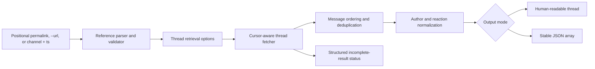

# Design: Exhaustive `thread-read` with reactions

**Date:** 2026-07-20
**Status:** Approved
**Decision:** Evolve the existing `thread-read` command

## Summary

`thread-read` MUST become the semantic command for retrieving a Slack thread from its parent message through its final reply, including reaction names and authoritative counts on every message.

The command MUST accept a pasted Slack permalink directly, retain its existing input forms, retrieve all pages by default, and support Slack's optional filtering and pagination parameters. No replacement command will be introduced.

## Goals

The evolved command MUST:

- Accept a copied Slack permalink as a positional argument.
- Resolve a reply permalink to its parent thread.
- Retrieve the parent and every reply in chronological order by default.
- Include every message's reaction emoji names and counts.
- Produce human-readable or stable JSON output.
- Preserve existing `--url` and `--channel` plus `--ts` usage.
- Support narrowing by cursor and timestamp boundaries.
- Detect and disclose incomplete results.
- Preserve existing exit-code and error-envelope conventions.

## Non-goals

This change MUST NOT:

- Retrieve reactor identities.
- Add attachments, files, Block Kit structures, or unfurled content.
- Summarize or interpret thread content.
- Add a general-purpose `read` command.
- Introduce a positional `CHANNEL:TIMESTAMP` compound identifier.
- Change `message-read`.
- Change the generic `conversations replies` command.
- Make per-message `reactions.get` calls.

A standalone message permalink MAY return a one-message result, preserving current Slack and CLI behavior.

## Ubiquitous language

- **Thread:** A parent Slack message and its threaded replies.
- **Permalink:** A URL copied from Slack for a parent message or reply.
- **Thread timestamp:** The Slack `ts` identifying the parent message.
- **Complete result:** Every message within the caller's requested cursor and time window.
- **Reaction summary:** An emoji name and its authoritative total count. Reactor identities are excluded.

## Command interface

### Preferred form

```bash
slack-cli thread-read \
  "https://stackexchange.slack.com/archives/C09M260TY7Q/p1784131538270229"
```

### Preserved forms

```bash
slack-cli thread-read --url "https://stackexchange.slack.com/archives/C09M260TY7Q/p1784131538270229"

slack-cli thread-read \
  --channel C09M260TY7Q \
  --ts 1784131538.270229
```

### Input modes

Exactly one mode MUST be supplied:

1. One positional permalink; the command MUST accept no more than one positional argument.
2. `--url <permalink>`.
3. `--channel <conversation-id>` together with `--ts <timestamp>`.

These modes MUST be mutually exclusive. `--channel` and `--ts` MUST remain required together.

A bare Slack timestamp MUST NOT be accepted because it is only unique within a conversation.

### Retrieval flags

| Flag | Meaning |
|---|---|
| `--cursor` | Start at a supplied Slack pagination cursor |
| `--oldest` | Exclude messages before this timestamp |
| `--latest` | Exclude messages after this timestamp |
| `--inclusive` | Include messages matching boundary timestamps |
| `--limit` | Maximum items requested per Slack API page |
| `--max-results` | Maximum unique messages returned in total |
| `--include-all-metadata` | Request metadata and include it in JSON when present |
| `--wait-on-rate-limit` | Wait and retry using Slack's `Retry-After` value |
| `--all` | Accepted but redundant; `thread-read` is exhaustive by default |
| `--json` | Emit the stable JSON representation |
| `--pretty` | Accepted and equivalent to the human-readable default |

`--limit=0` MUST use Slack's page-size default. `--max-results=0` MUST mean unlimited. The existing default of `--max-results=10000` remains unchanged.

When `--json` and the inherited `--pretty` flag are both present, `--json` MUST take precedence, preserving the existing command's behavior.

Negative limits, a negative maximum, and `oldest > latest` MUST produce input errors.

## Permalink normalization

The parser MUST:

1. Require an HTTP or HTTPS URL with a Slack hostname and `/archives/` path.
2. Extract a `C`, `D`, or `G` conversation ID.
3. Convert the path's `p1784131538270229` segment to `1784131538.270229`.
4. Prefer the `thread_ts` query parameter when present.
5. Validate `thread_ts` strictly; malformed values MUST NOT be ignored.
6. Validate `cid` when present and require it to match the path conversation.
7. Validate the final conversation ID and timestamp before calling Slack.

A reply permalink typically places the reply timestamp in the path and the parent timestamp in `thread_ts`. The parser MUST therefore anchor retrieval at `thread_ts` when available. See [Slack's permalink method](https://docs.slack.dev/reference/methods/chat.getPermalink/).

## Architecture



The design SHOULD use these isolated components:

- A pure reference parser that has no Slack API dependency.
- A small thread-client interface around `GetConversationRepliesContext`.
- A dedicated pagination loop for semantic thread retrieval.
- A thread-specific normalized message model.
- Thread-specific human and JSON formatters.
- Existing cache helpers for author resolution.

The existing `internal/dispatch.Paginate` MUST NOT be reused unchanged because it currently treats `--limit` as an effective total limit.

`message-read` MUST retain its existing formatter and JSON schema.

## Retrieval and pagination

The command MUST:

1. Parse and validate the input and filter options.
2. Verify that an authenticated Slack client exists.
3. Perform the existing nonblocking cache readiness check.
4. Load the existing ID-to-name cache once.
5. Request `conversations.replies` using the normalized conversation and timestamp.
6. Carry `oldest`, `latest`, `inclusive`, and `include_all_metadata` unchanged across pages.
7. Use a supplied `--cursor` only for the initial request.
8. Follow every returned cursor until completion or `--max-results`.
9. Reject a repeated cursor rather than entering an infinite loop.
10. Deduplicate messages by exact Slack timestamp.
11. Count unique messages, including the parent, against `--max-results`.
12. Sort the final result by exact Slack timestamp ascending.

The final request's page size MUST be the smaller of:

- The caller's `--limit`, when nonzero.
- The remaining `--max-results` capacity.

When `--limit=0` and a finite capacity remains, the remaining capacity SHOULD be used as the final request limit to avoid overshooting.

With `--cursor`, `--oldest`, or `--latest`, completeness means complete for that requested window. The parent MAY be absent when the selected window excludes it.

Slack documents that `conversations.replies` returns the parent before its replies and uses cursor pagination. See the [retrieval guide](https://docs.slack.dev/messaging/retrieving-messages/) and [`conversations.replies` reference](https://docs.slack.dev/reference/methods/conversations.replies/).

## Maximum-result behavior

If `--max-results` is reached and Slack returns another cursor:

- The command MUST return the selected messages.
- The command MUST exit successfully because the requested cap was honored.
- The result MUST be explicitly identified as incomplete.
- The returned cursor MUST allow the caller to resume with the same filters.

In JSON mode, stdout remains the message array. Stderr MUST receive:

```json
{
  "complete": false,
  "reason": "max_results",
  "next_cursor": "dXNlcjp..."
}
```

Human mode MUST emit an equivalent warning to stderr:

```text
Warning: result limited by --max-results; resume with --cursor dXNlcjp...
```

When the final cursor is empty, no completeness warning is emitted.

API failures, cancellation, repeated cursors, or exhausted rate-limit retries MUST NOT emit a partial thread to stdout.

## Rate-limit behavior

Without `--wait-on-rate-limit`, a Slack rate-limit response MUST use the existing API-error classification.

With the flag enabled, the fetcher MUST:

- Wait for Slack's `Retry-After` duration.
- Remain cancellable through the command context.
- Retry no more than three consecutive rate-limit responses for the same cursor.
- Reset the consecutive-retry count after a successful page.

Slack's current limits vary by application distribution, making explicit pagination and retry behavior necessary. See the [`conversations.replies` limits](https://docs.slack.dev/reference/methods/conversations.replies/).

## Normalized data contract

Each thread message MUST preserve:

- Resolved author name or existing fallback.
- Existing RFC3339 timestamp.
- Exact Slack timestamp.
- Message text.
- Reaction summaries.
- Optional Slack metadata when requested.

Conceptually:

```go
type threadReaction struct {
    Name  string
    Count int
}

type threadMessage struct {
    User      string
    Time      time.Time
    SlackTS   string
    Text      string
    Reactions []threadReaction
    Metadata  *slack.SlackMetadata
}
```

Reaction summaries MUST:

- Include only `name` and `count`.
- Exclude reactor IDs.
- Be sorted lexicographically by emoji name.
- Treat Slack's count as authoritative.
- Always be represented as an array in JSON.

Slack states that reaction counts are authoritative while supplied reactor lists can be incomplete. See the [message reaction documentation](https://docs.slack.dev/reference/events/message/).

## Human-readable output

A message with reactions MUST render:

```text
Peter O'Connor [2026-07-15 13:05]: The deployment is complete.
  Reactions: :eyes: 2, :white_check_mark: 4
```

A message without reactions MUST preserve the existing single-line form:

```text
Peter O'Connor [2026-07-15 13:05]: The deployment is complete.
```

Requirements:

- Each reaction-bearing message receives exactly one indented reaction line.
- Reactions use `:<name>: <count>`.
- Multiple reactions are comma-separated and sorted by name.
- The reaction line is omitted when there are none.
- Metadata is never rendered in human output.
- Message text continues to use the existing text-only behavior.

## JSON output

The top-level representation MUST remain an array for compatibility:

```json
[
  {
    "user": "Peter O'Connor",
    "ts": "2026-07-15T13:05:38-04:00",
    "slack_ts": "1784131538.270229",
    "text": "The deployment is complete.",
    "reactions": [
      {
        "name": "eyes",
        "count": 2
      },
      {
        "name": "white_check_mark",
        "count": 4
      }
    ]
  },
  {
    "user": "Brendan Rosage",
    "ts": "2026-07-15T13:07:10-04:00",
    "slack_ts": "1784131630.101010",
    "text": "Confirmed.",
    "reactions": []
  }
]
```

The existing `user`, `ts`, and `text` fields MUST remain unchanged.

`slack_ts` is additive and preserves the exact Slack message identifier that RFC3339 cannot represent.

`reactions` MUST always be present, including `[]`.

When `--include-all-metadata` is set and Slack returns metadata, the message MUST additionally contain:

```json
{
  "metadata": {
    "event_type": "deployment_completed",
    "event_payload": {}
  }
}
```

Without that flag, `metadata` MUST be omitted.

When the flag is set but Slack returns no metadata for a message, `metadata` MUST also be omitted for that message.

## Error handling

| Condition | Exit code |
|---|---:|
| Malformed or conflicting input | 3 |
| Invalid filters or negative limits | 3 |
| Missing token or missing required scope | 2 |
| Slack `thread_not_found` or other API rejection | 1 |
| Rate limit without successful retry | 1 |
| Repeated pagination cursor | 1 |
| Network failure or context cancellation | 4 |
| Output write failure | 4 |
| Intentional `--max-results` truncation | 0 with incomplete status |

Errors MUST retain the existing JSON error envelope on stderr. Normal stdout MUST remain parseable and MUST NOT contain warnings.

## Compatibility

The change MUST preserve:

- Existing command name.
- Human-readable default output.
- `--json`.
- `--url`.
- `--channel` plus `--ts`.
- Author cache behavior.
- Bot and unresolved-user fallbacks.
- JSON array topology.
- Existing error envelope and exit codes.

The following additive changes are intentional:

- A positional permalink.
- Exhaustive pagination by default.
- `slack_ts` in JSON.
- `reactions` in every JSON message.
- Reaction lines in human output.
- Optional metadata in JSON.
- Explicit incomplete-result status.

`--all` remains accepted but is redundant. A compound positional thread identifier remains out of scope.

## BDD and verification

Implementation MUST use BDD Red-Green-Refactor.

The client boundary MUST be injectable so pagination, retries, and errors can be tested without live Slack access.

Required scenarios include:

- Root permalink as a positional argument.
- Reply permalink anchored through `thread_ts`.
- Legacy `--url`.
- Legacy `--channel` plus `--ts`.
- Every input-mode conflict.
- `C`, `D`, and `G` conversation IDs.
- Malformed `thread_ts` and mismatched `cid`.
- Standalone one-message results.
- Multiple pagination pages.
- Cursor resumption.
- Repeated-cursor rejection.
- Deduplication at page boundaries.
- Ascending timestamp order.
- Every narrowing flag carried across pages.
- `--limit` as page size.
- Exact-cap and cap-plus-one behavior.
- Unlimited `--max-results=0`.
- Reaction sorting and formatting.
- Empty JSON reaction arrays.
- Metadata included only when requested.
- Cache name resolution and fallbacks.
- Rate limiting with and without waiting.
- Cancellation while waiting.
- A failure on a later page with no partial stdout.
- Empty API responses.
- Output write errors.
- Backward-compatible human and JSON snapshots.
- Existing exit-code behavior.

Verification MUST include:

```bash
make test
make lint
```

## Documentation and decision records

The durable exhaustive-retrieval and compatibility decisions MUST be recorded in `docs/adr/0001-exhaustive-thread-read.md` using MADR format.

Implementation MUST update:

- `README.md`
- `skill/SKILL.md`
- CLI help text
- `CONTRIBUTING.md`
- Relevant command and formatter documentation

The specification and ADR MUST be mirrored to the authoritative Obsidian drafts location with the required AI footer.

## Acceptance criteria

The work is complete only when:

1. Pasting the provided permalink retrieves the parent and every reply.
2. Pasting a reply permalink still begins at the parent.
3. Threads longer than one API page are complete by default.
4. Every message includes all reaction names and counts.
5. Human output uses the approved indented reaction line.
6. JSON always contains `reactions` and exact `slack_ts`.
7. Narrowing and pagination flags follow the defined semantics.
8. Capped results disclose incompleteness and provide a resumable cursor.
9. Existing input forms and output topology remain compatible.
10. Required BDD scenarios, `make test`, and `make lint` pass.
11. README, skill documentation, contributor guidance, design specification, and ADR agree.

*Authored By Peter O'Connor with Assistance from Claude Code (GPT-5) · 2026-07-20 · slack-cli exhaustive thread-read design*
